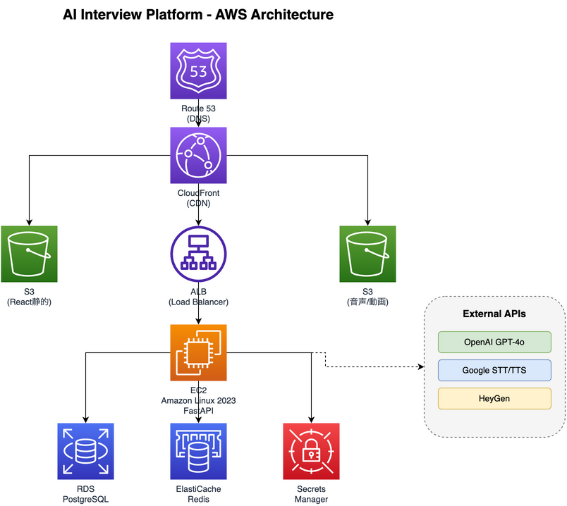

# 4. AWSインフラ構成

## 4.1 アーキテクチャ図

## 4.2 コンポーネント詳細

| サービス                  | 用途             | 備考                            |
| ------------------------- | ---------------- | ------------------------------- |
| **Route 53**        | DNS管理          | ドメイン設定                    |
| **CloudFront**      | CDN              | 静的ファイル配信、SSL終端       |
| **ALB**             | ロードバランサー | API振り分け、ヘルスチェック     |
| **EC2**             | アプリサーバー   | FastAPI実行 (Amazon Linux 2023) |
| **S3 (静的)**       | Reactアプリ      | ビルド済みファイルをホスト      |
| **S3 (メディア)**   | 音声/動画        | ユーザーの録音データ等          |
| **RDS**             | PostgreSQL       | ユーザーデータ、面接履歴        |
| **ElastiCache**     | Redis            | セッション、キャッシュ          |
| **Secrets Manager** | 機密情報         | APIキー管理                     |

## 4.3 EC2インスタンス構成

| 項目               | 開発環境          | 本番環境          |
| ------------------ | ----------------- | ----------------- |
| インスタンスタイプ | t3.medium         | t3.large          |
| OS                 | Amazon Linux 2023 | Amazon Linux 2023 |
| ストレージ         | gp3 30GB          | gp3 50GB          |
| Python             | 3.11 or 3.12      | 3.11 or 3.12      |

## 4.4 セキュリティグループ設計

| セキュリティグループ | インバウンドルール                       |
| -------------------- | ---------------------------------------- |
| ALB SG               | 443 (HTTPS) from 0.0.0.0/0               |
| EC2 SG               | 8000 from ALB SG, 22 (SSH) from 管理者IP |
| RDS SG               | 5432 from EC2 SG                         |
| ElastiCache SG       | 6379 from EC2 SG                         |

## 4.5 コスト概算（月額）

| サービス    | 開発環境         | 本番環境 |
| ----------- | ---------------- | -------- |
| EC2         | $30        | $60 |          |
| RDS         | $15 | $30        |          |
| S3          | $5 | $20         |          |
| CloudFront  | $5 | $20         |          |
| ALB         | $20 | $20        |          |
| ElastiCache | $15 | $30        |          |
| 合計        | $90 | $180       |          |

※外部API（OpenAI、Google Cloud、HeyGen）のコストは別途
