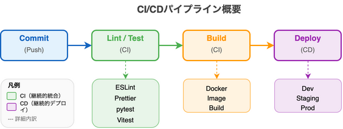

# 5. プロジェクト構成

## 5.1 リポジトリ構成

モノレポ構成を採用。

```
ai-interview/
├── poc/                     # POC（Proof of Concept）アプリ
│   └── src/
│       ├── app/             # Next.js App Router
│       │   └── api/
│       │       └── questions/
│       │           └── route.ts          # 質問取得API
│       ├── components/      # UIコンポーネント
│       │   ├── InterviewSession.tsx      # 面接セッション
│       │   ├── InterviewHeyGenAvatar.tsx # HeyGenアバター
│       │   ├── AudioRecorder.tsx         # 録音コンポーネント
│       │   └── FeedbackDisplay.tsx       # フィードバック表示
│       ├── hooks/           # カスタムフック
│       ├── services/        # サービス
│       ├── types/           # 型定義
│       │   └── interview.ts              # 面接関連型定義
│       └── utils/           # ユーティリティ
│
├── frontend/                # React アプリ（本番用）
│   ├── src/
│   │   ├── components/      # UIコンポーネント
│   │   ├── pages/           # ページコンポーネント
│   │   ├── hooks/           # カスタムフック
│   │   ├── services/        # API呼び出し
│   │   └── types/           # 型定義
│   ├── package.json
│   └── vite.config.ts
│
├── backend/                 # FastAPI アプリ
│   ├── app/
│   │   ├── api/
│   │   │   └── routes/      # エンドポイント
│   │   ├── core/            # 設定、セキュリティ
│   │   ├── models/          # DBモデル (SQLAlchemy)
│   │   ├── schemas/         # リクエスト/レスポンス定義 (Pydantic)
│   │   ├── services/        # ビジネスロジック
│   │   │   ├── ai/          # LLM、STT/TTS処理
│   │   │   └── interview/   # 面接関連ロジック
│   │   └── main.py
│   ├── tests/
│   └── requirements.txt
│
├── infra/                   # インフラ設定
│   ├── docker/
│   └── aws/
│
├── docs/                    # ドキュメント
│   ├── images/
│   └── 基本設計書/
│
└── README.md
```

---

## 5.2 命名規約

### 5.2.1 ファイル・ディレクトリ命名

| 対象 | 規約 | 例 |
|------|------|-----|
| フロントエンド コンポーネント | PascalCase | `InterviewSession.tsx`, `FeedbackCard.tsx` |
| フロントエンド フック | camelCase（use接頭辞） | `useSession.ts`, `useAvatarConnection.ts` |
| フロントエンド サービス | camelCase | `sessionService.ts`, `evaluationApi.ts` |
| バックエンド モジュール | snake_case | `session_service.py`, `evaluation_logic.py` |
| バックエンド ルート | snake_case | `sessions.py`, `evaluations.py` |
| テストファイル | 対象ファイル名 + `.test` or `test_` | `InterviewSession.test.tsx`, `test_session_service.py` |

### 5.2.2 変数・関数命名

| 言語 | 変数 | 関数 | クラス | 定数 |
|------|------|------|--------|------|
| TypeScript | camelCase | camelCase | PascalCase | UPPER_SNAKE_CASE |
| Python | snake_case | snake_case | PascalCase | UPPER_SNAKE_CASE |

### 5.2.3 API命名

| リソース | HTTPメソッド | エンドポイント | 例 |
|---------|-------------|---------------|-----|
| セッション一覧取得 | GET | `/api/v1/{resource}` | `/api/v1/sessions` |
| セッション作成 | POST | `/api/v1/{resource}` | `/api/v1/sessions` |
| セッション取得 | GET | `/api/v1/{resource}/{id}` | `/api/v1/sessions/123` |
| セッション更新 | PUT | `/api/v1/{resource}/{id}` | `/api/v1/sessions/123` |
| セッション削除 | DELETE | `/api/v1/{resource}/{id}` | `/api/v1/sessions/123` |

---

## 5.3 テスト構成

### 5.3.1 テストディレクトリ構造

```
ai-interview/
├── frontend/
│   ├── src/
│   │   ├── components/
│   │   │   └── __tests__/           # コンポーネントテスト
│   │   ├── hooks/
│   │   │   └── __tests__/           # フックテスト
│   │   └── services/
│   │       └── __tests__/           # サービステスト
│   └── e2e/                         # E2Eテスト（Playwright）
│       ├── fixtures/
│       └── specs/
│
└── backend/
    └── tests/
        ├── unit/                    # ユニットテスト
        │   ├── services/
        │   └── models/
        ├── integration/             # 統合テスト
        │   └── api/
        └── conftest.py              # pytest共通設定
```

### 5.3.2 テスト種別と対象

| テスト種別 | 対象 | ツール | カバレッジ目標 |
|-----------|------|--------|--------------|
| ユニットテスト（FE） | コンポーネント、フック、ユーティリティ | Vitest + React Testing Library | 80% |
| ユニットテスト（BE） | サービス、モデル、ユーティリティ | pytest | 80% |
| 統合テスト（BE） | APIエンドポイント | pytest + httpx | 主要パス100% |
| E2Eテスト | 画面遷移、ユーザーフロー | Playwright | 主要フロー100% |

### 5.3.3 テスト実行コマンド

| 環境 | コマンド | 説明 |
|------|---------|------|
| フロントエンド | `npm run test` | ユニットテスト実行 |
| フロントエンド | `npm run test:coverage` | カバレッジ付きテスト |
| フロントエンド | `npm run test:e2e` | E2Eテスト実行 |
| バックエンド | `pytest` | 全テスト実行 |
| バックエンド | `pytest --cov=app` | カバレッジ付きテスト |
| バックエンド | `pytest tests/unit` | ユニットテストのみ |

---

## 5.4 CI/CD構成

### 5.4.1 CI/CDパイプライン概要



### 5.4.2 GitHub Actions ワークフロー

| ワークフロー | トリガー | 実行内容 |
|------------|---------|---------|
| `ci.yml` | Push, PR | Lint、テスト、ビルド検証 |
| `deploy-dev.yml` | develop ブランチへのPush | 開発環境へデプロイ |
| `deploy-staging.yml` | staging ブランチへのPush | ステージング環境へデプロイ |
| `deploy-prod.yml` | main ブランチへのPush + 手動承認 | 本番環境へデプロイ |

### 5.4.3 デプロイ環境

| 環境 | 用途 | ブランチ | 自動デプロイ |
|------|------|---------|-------------|
| Development | 開発検証 | develop | Yes |
| Staging | QA・受入テスト | staging | Yes |
| Production | 本番運用 | main | No（手動承認） |

### 5.4.4 品質ゲート

CIパイプラインで以下のチェックに合格しないとマージ不可:

| チェック項目 | 基準 |
|-------------|------|
| Lintエラー | 0件 |
| テストカバレッジ（FE） | 80%以上 |
| テストカバレッジ（BE） | 80%以上 |
| セキュリティスキャン | High/Critical 0件 |
| ビルド成功 | 必須 |
