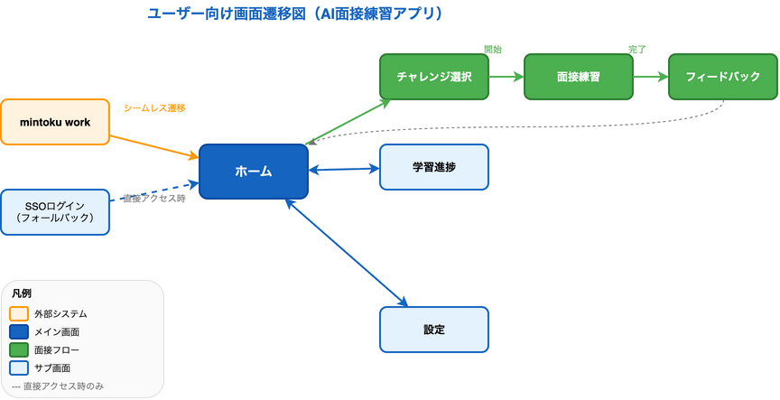
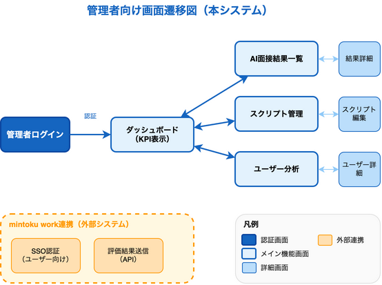
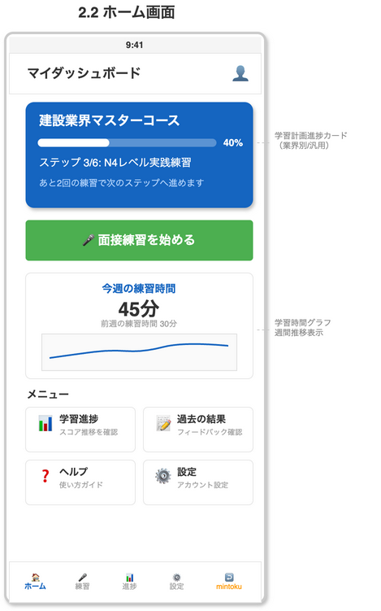
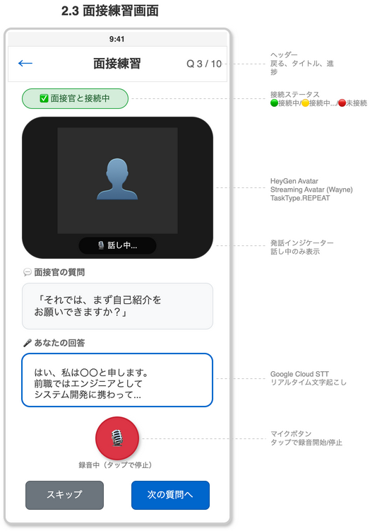
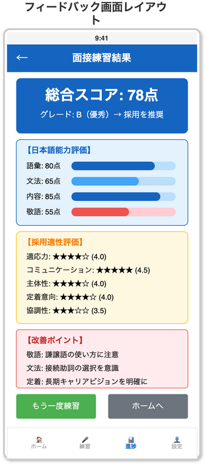
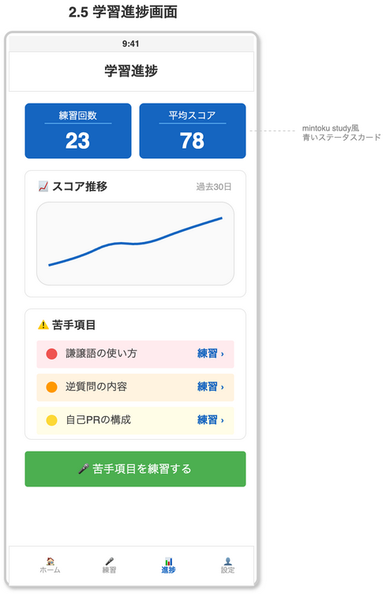
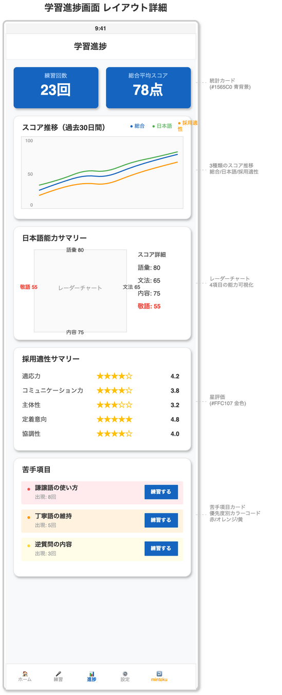
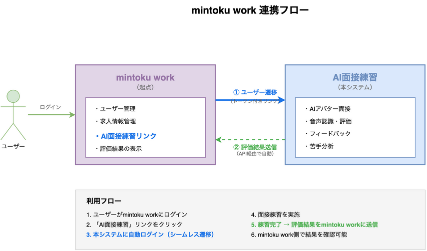

# 6. 画面設計

## 6.1 画面一覧

### 6.1.1 外国人ユーザー向け画面（モバイル）

| No | 画面名 | 説明 |
|----|--------|------|
| 1 | SSOログイン | フォールバック用認証画面（直接アクセス時のみ表示） |
| 2 | ホーム | メインダッシュボード、各機能へのナビゲーション |
| 3 | 面接練習 | AIアバターとの面接練習画面 |
| 4 | フィードバック | 練習結果の詳細評価表示 |
| 5 | 学習進捗 | スコア推移、苦手項目の確認 |

### 6.1.2 管理者向け機能（mintoku work側で提供）

> **注意**: 管理者向け機能は**mintoku work**の管理画面で提供されます。
> 本システムは管理者向け画面を持ちません。

| 機能 | 説明 | 提供場所 |
|------|------|----------|
| AI面接結果確認 | ユーザーの面接練習結果・スコアの確認 | mintoku work |
| ダッシュボード | KPI表示、アクティビティ監視 | mintoku work |
| スクリプト管理 | 面接スクリプトの登録・編集 | mintoku work |
| ユーザー分析 | 個別ユーザーの詳細分析 | mintoku work |

### 6.1.3 画面遷移図（ユーザー向け）



### 6.1.4 画面遷移図（管理者向け）



---

## 6.2 外国人ユーザー向け画面

### 6.2.1 SSOログイン画面（フォールバック用）


> **注意**: この画面は直接アクセス時のフォールバック用です。
> 通常フロー（外部システムからのリンク経由）ではこの画面は表示されません。

#### 表示条件

| 条件 | この画面の表示 |
|------|---------------|
| 外部システムからリンク経由でアクセス | **表示されない**（直接ホームへ） |
| ブラウザで直接URLアクセス/ブックマーク | 表示される |
| アプリ直接起動（トークン期限切れ） | 表示される |
| セッション切れ後の再認証 | 表示される |

#### 画面要素

| 要素 | 説明 |
|------|------|
| アプリロゴ | 青い円形アイコン + 「AI Interview」タイトル |
| ようこそメッセージ | ログイン案内テキスト |
| SSOログインボタン | 「mintoku workでログイン」青いCTA |
| 案内テキスト | 初回ログイン時の自動登録説明 |
| 言語セレクター | 表示言語の変更（日本語/英語/他） |

#### デザイン仕様（mintoku study準拠）

| 項目 | 値 |
|------|------|
| アクセントカラー | #1565C0（青） |
| ボタン角丸 | 8px |
| カード背景 | #FFFFFF（白） |
| 画面背景 | #F5F5F5（薄いグレー） |

#### フォールバック認証フロー

```
直接アクセス → ログイン画面 → SSOボタン → 外部IdP → 認証 → ホーム画面
```

#### 備考

- **通常はこの画面を経由しない**（外部システムからシームレス遷移）
- 直接アクセス時のみ表示されるフォールバック画面
- 初回ログイン時に自動でユーザー登録
- メールアドレス/パスワードの直接入力は不要

---

### 6.2.2 ホーム画面



#### 画面要素

| 要素 | 説明 |
|------|------|
| ヘッダー | 「マイダッシュボード」タイトル、プロフィールアイコン |
| 面接練習の状況カード | 2x2グリッドの青いステータスカード（全体、未スタート、学習中、練習完了） |
| 面接練習を始めるボタン | 緑色のメインCTA、練習開始 |
| 今週の練習時間 | 学習時間表示（45分）、前週との比較、週間推移グラフ |
| メニューカード | 学習進捗、過去の結果、ヘルプ、設定（各カードにサブタイトル付き） |
| ボトムナビゲーション | ホーム、練習、進捗、設定 |

#### デザイン仕様（mintoku study準拠）

| 項目 | 値 |
|------|------|
| ステータスカード背景色 | #1565C0（青） |
| CTAボタン背景色 | #4CAF50（緑） |
| カード角丸 | 8px |
| 統計数字フォントサイズ | 28px（太字） |
| 背景色 | #F5F5F5（薄いグレー） |

---

### 6.2.3 面接練習画面



#### 画面要素

| 要素 | 説明 |
|------|------|
| ヘッダー | 戻るボタン（←）、タイトル「面接練習」、質問番号（Q 3/10） |
| 接続ステータス | アバターとの接続状態（🟢 接続中 / 🟡 接続中... / 🔴 未接続） |
| AIアバターエリア | HeyGen Streaming Avatarによる面接官表示 |
| 発話インジケーター | 面接官が話している間「🎙️ 話し中...」を表示 |
| 質問表示ボックス | 面接官が話した質問をテキストでも表示 |
| 回答エリア | Google STTによるリアルタイム文字起こし表示 |
| マイクボタン | 録音開始/停止（タップで切り替え） |
| スキップボタン | 現在の質問をスキップして次へ |
| 次の質問へボタン | 回答完了後、次の質問に進む |

#### AIアバター仕様（HeyGen）

| 項目 | 内容 |
|------|------|
| サービス | HeyGen Streaming Avatar |
| SDK | `@heygen/streaming-avatar` |
| アバター | Wayne（アジア系男性） |
| 発話方式 | TaskType.REPEAT（セリフ通り発話） |
| 通信 | WebRTC |

#### 接続ステータス

| ステータス | 表示 | 背景色 |
|-----------|------|--------|
| 接続中 | 🟢 面接官と接続中 | #d4edda（緑） |
| 接続処理中 | 🟡 接続中... | #fff3cd（黄） |
| 未接続 | 🔴 未接続 | #f8d7da（赤） |

#### 面接フロー

```
1. 画面表示 → HeyGenアバター接続開始
2. 接続完了 → 面接官が挨拶「こんにちは。本日は面接にお越しいただきありがとうございます。」
3. 質問読み上げ → アバターがリップシンクで質問を発話
4. ユーザー回答 → マイクボタンタップで録音開始
5. 音声認識 → Google STTでリアルタイム文字起こし
6. 回答完了 → 「次の質問へ」または自動で次へ
7. 全質問完了 → フィードバック画面へ遷移
```

#### 機能仕様

| 機能 | 説明 |
|------|------|
| リップシンク | HeyGen Avatarが質問を口の動きと同期して読み上げ |
| リアルタイム文字起こし | Google Cloud STTで音声をリアルタイムにテキスト化 |
| 録音インジケーター | 録音中はマイクアイコンがアニメーション |
| 自動停止 | 5秒間の無音で録音自動停止 |
| スキップ | 質問をスキップ可能（スコアには影響） |

#### エラーハンドリング

| エラー | 対応 |
|--------|------|
| アバター接続失敗 | 再接続ボタン表示、3回失敗でテキストのみモードに切替 |
| マイク許可なし | 設定画面への誘導ダイアログ表示 |
| 音声認識失敗 | テキスト入力フォールバック表示 |
| ネットワーク切断 | 自動再接続試行、失敗時は中断確認ダイアログ |

---

### 6.2.4 フィードバック画面


> **評価体系について**
> フィードバック画面では、日本語能力評価（07_評価ロジック）と採用適性評価（13_面接シナリオ設計）の両方を表示する。

#### 画面要素

| 要素 | 説明 |
|------|------|
| ヘッダー | 戻るボタン（←）、「練習結果」タイトル |
| 総合スコアカード | 青いカードに白文字で大きくスコア表示（78/100点）、グレード表示（B: 優秀） |
| 日本語能力評価カード | 語彙、文法、内容、敬語の各スコア（0-100点）をプログレスバーで表示 |
| 採用適性評価カード | 適応力、コミュニケーション力、主体性、定着意向、協調性の各スコア（1-5点）を星評価で表示 |
| 改善ポイントカード | AIが特定した弱点と改善提案 |
| ボトムナビゲーション | ホーム、練習、進捗、設定 |

#### 評価表示レイアウト



#### デザイン仕様（mintoku study準拠）

| 項目 | 値 |
|------|------|
| スコアカード背景色 | #1565C0（青） |
| プログレスバー背景 | #E3F2FD（薄い青） |
| 星評価アクティブ色 | #FFC107（金） |
| 星評価非アクティブ色 | #E0E0E0（グレー） |
| カード角丸 | 8px |
| 数字フォントサイズ | 48px（スコア） |

#### スコア表示ルール（日本語能力評価）

| スコア範囲 | 色 | カラーコード |
|-----------|-----|------------|
| 80-100 | 青 | #1565C0 |
| 60-79 | ライトブルー | #42A5F5 |
| 0-59 | 赤 | #EF5350 |

#### グレード表示ルール（採用適性評価）

| グレード | スコア範囲 | ラベル | 色 |
|---------|----------|-------|-----|
| A | 4.5-5.0 | 非常に優秀 | #1565C0（青） |
| B | 4.0-4.49 | 優秀 | #1E88E5（青） |
| C | 3.5-3.99 | 良好 | #42A5F5（ライトブルー） |
| D | 3.0-3.49 | 標準 | #90CAF9（薄い青） |
| E | 2.0-2.99 | 要検討 | #FF9800（オレンジ） |
| F | 1.0-1.99 | 不適合 | #EF5350（赤） |

---

### 6.2.5 学習進捗画面



> **評価体系について**
> 学習進捗画面では、日本語能力評価（07_評価ロジック）と採用適性評価（13_面接シナリオ設計）の両方の推移を表示する。

#### 画面要素

| 要素 | 説明 |
|------|------|
| ヘッダー | 「学習進捗」タイトル |
| 統計カード | 青い3カードレイアウト（練習回数、総合平均スコア、平均グレード） |
| スコア推移カード | 過去30日間の総合スコア・日本語能力スコア・採用適性スコアの推移をグラフ表示 |
| 日本語能力サマリーカード | 語彙・文法・内容・敬語の平均スコアをレーダーチャートで表示 |
| 採用適性サマリーカード | 適応力・コミュニケーション力・主体性・定着意向・協調性の平均スコアを星評価で表示 |
| 苦手項目カード | 優先度別（赤/オレンジ/黄）の日本語苦手項目と「練習」リンク |
| ボトムナビゲーション | ホーム、練習、進捗、設定 |

#### 学習進捗表示レイアウト



#### デザイン仕様（mintoku study準拠）

| 項目 | 値 |
|------|------|
| 統計カード背景色 | #1565C0（青） |
| 統計数字フォントサイズ | 28px（太字） |
| カード角丸 | 8px |
| 星評価アクティブ色 | #FFC107（金） |
| 星評価非アクティブ色 | #E0E0E0（グレー） |
| 苦手項目（高）背景 | #FFEBEE + #EF5350ドット |
| 苦手項目（中）背景 | #FFF3E0 + #FF9800ドット |
| 苦手項目（低）背景 | #FFFDE7 + #FDD835ドット |

#### グラフ表示

| 項目 | 表示内容 |
|------|---------|
| 総合スコア推移 | 日本語能力と採用適性を統合したスコア（0-100点） |
| 日本語能力推移 | 語彙・文法・内容・敬語の平均スコア（0-100点） |
| 採用適性推移 | 5つの評価軸の平均スコア（1-5点を0-100点にスケール） |

---

## 6.3 管理者向け機能（mintoku work側で提供）

> **重要**: 管理者向け機能は**mintoku work**の管理画面で提供されます。
> 本システムは評価結果をmintoku workにAPIで送信し、管理者はmintoku work側で確認します。
> そのため、本システムには管理者向け画面は含まれません。

### 6.3.1 mintoku workで提供される管理機能

| 機能 | 説明 |
|------|------|
| AI面接結果確認 | ユーザーの面接練習結果・スコア・苦手項目の確認 |
| ダッシュボード | 総ユーザー数、練習数、平均スコアなどのKPI表示 |
| スクリプト管理 | 面接スクリプトの登録・編集（API経由で本システムに反映） |
| ユーザー分析 | 個別ユーザーの成長曲線、苦手項目の統計 |

### 6.3.2 本システムからmintoku workへの連携データ

練習完了時に以下のデータをmintoku workのAPIに送信します。
日本語能力評価（07_評価ロジック）と採用適性評価（13_面接シナリオ設計）の両方を含みます。

```json
{
  "user_id": "mintoku_user_123",
  "session_id": "practice_session_456",
  "completed_at": "2025-01-30T14:30:00Z",
  "total_score": 78,
  "grade": "B",
  "grade_label": "優秀",
  "recommendation": "採用を推奨",
  "japanese_proficiency": {
    "score": 71,
    "vocabulary": 80,
    "grammar": 65,
    "content": 75,
    "honorifics": 55
  },
  "aptitude": {
    "score": 4.0,
    "adaptability": 4.0,
    "communication": 4.5,
    "initiative": 4.0,
    "retention": 4.0,
    "cooperation": 3.5
  },
  "weak_points": [
    {"category": "honorifics", "description": "謙譲語の使い方"},
    {"category": "grammar", "description": "丁寧語の維持"}
  ],
  "script_type": "IT企業向け基本面接",
  "jlpt_level": "N3",
  "practice_count": 24,
  "duration_seconds": 420
}
```

---

## 6.4 画面遷移の説明

> 画面遷移図は6.1.3（ユーザー向け）および6.1.4（管理者向け）を参照。

### 6.4.1 フォールバックフロー（直接アクセス時）

直接アクセス/ブックマーク/アプリ起動時のみSSOログイン画面を経由する。

### 6.4.2 ユーザー向け画面遷移

ホーム画面を起点に各機能画面へ遷移。各画面からホームへ戻ることが可能。

### 6.4.3 管理者向け機能

管理者向け機能はmintoku workの管理画面で提供される（本システムには管理者画面なし）。mintoku workからAPI経由で本システムにスクリプトを同期し、本システムからmintoku workへ評価結果を送信する。

### 6.4.4 対応プラットフォーム

同一のReact Webアプリケーションをブラウザ/iOS(WebView)/Android(WebView)で表示。

---

## 6.5 認証方式

### 6.5.1 mintoku work 連携概要

本システムは「**mintoku work**」を起点とし、ユーザーはmintoku workから本システムに遷移する。



### 6.5.2 SSO（シングルサインオン）

| 項目 | 内容 |
|------|------|
| 認証方式 | OAuth 2.0 / OpenID Connect |
| IdP連携先 | **mintoku work** |
| ユーザー登録 | 初回SSO時に自動作成 |
| セッション管理 | JWT |
| 遷移方式 | シームレス遷移（ログイン画面スキップ） |

### 6.5.3 シームレス遷移フロー（推奨）

mintoku workからのリンククリックで直接ホーム画面へ遷移する方式。

```
1. ユーザーがmintoku workにログイン済み
2. mintoku work内の「AI面接練習」リンクをクリック
   - リンク例: https://ai-interview.example.com/auth/callback?token=xxx
3. 本アプリがトークンを検証
4. ユーザー情報取得、なければ自動登録
5. JWTを発行してセッション確立
6. ホーム画面に直接遷移（ログイン画面は表示されない）
```

#### mintoku work側の実装要件

| 項目 | 内容 |
|------|------|
| リンク生成 | 署名付きトークン（HMAC-SHA256）を含むURL生成 |
| トークン内容 | user_id, email, name, organization, jlpt_level, exp（有効期限） |
| 有効期限 | 発行から5分以内 |
| セキュリティ | HTTPS必須、トークンは1回使い切り |

### 6.5.4 フォールバックフロー（直接アクセス時）

ユーザーがブックマーク等から直接アクセスした場合のフロー。

```
1. ユーザーがログイン画面にアクセス
2. SSOログインボタンをクリック
3. mintoku workの認証画面にリダイレクト
4. ユーザーがmintoku workで認証
5. コールバックURLにリダイレクト（認証コード付き）
6. バックエンドでトークン交換
7. ユーザー情報取得、なければ自動登録
8. JWTを発行してフロントエンドに返却
9. ホーム画面に遷移
```

### 6.5.5 mintoku workから取得するユーザー情報

| 項目 | 必須 | 説明 |
|------|------|------|
| user_id | ○ | mintoku work側のユーザーID |
| メールアドレス | ○ | 一意識別子 |
| 氏名 | ○ | 表示名 |
| 所属組織 | ○ | 人材紹介会社/学校名 |
| JLPTレベル | △ | 未設定の場合は初回設定画面へ |

### 6.5.6 評価結果のmintoku work連携

面接練習完了後、評価結果をmintoku workのAPIに送信する。

#### 連携タイミング

| タイミング | 送信内容 |
|-----------|---------|
| 練習完了時 | 総合スコア、項目別スコア、苦手項目 |
| 日次バッチ | 累計練習回数、平均スコア推移 |

#### mintoku work APIへの送信データ

日本語能力評価と採用適性評価の両方を送信します。詳細は10_API仕様 10.6節を参照。

```json
{
  "user_id": "mintoku_user_123",
  "session_id": "practice_session_456",
  "completed_at": "2025-01-30T14:30:00Z",
  "total_score": 78,
  "grade": "B",
  "japanese_proficiency": {
    "score": 71,
    "vocabulary": 80,
    "grammar": 65,
    "content": 75,
    "honorifics": 55
  },
  "aptitude": {
    "score": 4.0,
    "adaptability": 4.0,
    "communication": 4.5,
    "initiative": 4.0,
    "retention": 4.0,
    "cooperation": 3.5
  },
  "weak_points": [
    {"category": "honorifics", "description": "謙譲語の使い方"},
    {"category": "grammar", "description": "丁寧語の維持"}
  ],
  "script_type": "IT企業向け基本面接",
  "jlpt_level": "N3",
  "practice_count": 24
}
```

#### API仕様（mintoku work側で用意）

| 項目 | 内容 |
|------|------|
| エンドポイント | `POST https://api.mintoku-work.com/v1/interview-results` |
| 認証 | API Key または OAuth2 Client Credentials |
| レスポンス | 成功時 200 OK、エラー時は適切なステータスコード |
| リトライ | 失敗時は指数バックオフで最大3回リトライ |

---

## 6.6 対応プラットフォーム

### 6.6.1 アーキテクチャ

```
┌─────────────────────────────────────────────────┐
│          Webアプリケーション（React）            │
│              モバイル優先レスポンシブ            │
└─────────────────────────────────────────────────┘
        ↑               ↑               ↑
   ┌────┴────┐    ┌─────┴─────┐   ┌─────┴─────┐
   │ブラウザ  │    │ iOSアプリ  │   │Androidアプリ│
   │         │    │ (WebView) │   │ (WebView)  │
   └─────────┘    └───────────┘   └────────────┘
```

### 6.6.2 ユーザー向け

| プラットフォーム | 対応 | 実装方式 |
|-----------------|------|----------|
| Webブラウザ（モバイル） | ○ | React（モバイル優先 375px〜） |
| Webブラウザ（PC） | ○ | React（タブレット/デスクトップ対応） |
| iOSアプリ | ○ | **WebView**（同一Webアプリを表示） |
| Androidアプリ | ○ | **WebView**（同一Webアプリを表示） |

### 6.6.3 管理者向け

管理者向け機能はmintoku workの管理画面で提供されるため、本システムでは対応しません。

### 6.6.4 WebViewアプリの認証フロー

| 項目 | 内容 |
|------|------|
| シームレス遷移 | 外部システムからURLスキーム/Universal Linkで起動 |
| URL例 | `aiinterview://open?token=xxx` または `https://app.example.com/auth?token=xxx` |
| トークン保存 | WebView内のCookie/LocalStorage |
| 自動ログイン | 保存済みセッションが有効な場合、直接ホームへ |

### 6.6.5 WebView方式のメリット

| メリット | 説明 |
|---------|------|
| 開発効率 | Web版と同一コードベース、保守が容易 |
| 即時反映 | サーバー側更新でアプリも即座に反映 |
| 一貫したUI | ブラウザ/アプリで同一の画面・操作感 |
| ストア審査 | コンテンツ更新時にストア再審査不要 |

---

## 改訂履歴

| 日付 | バージョン | 内容 |
|------|-----------|------|
| 2025-01-30 | 1.0 | 初版作成 |
| 2025-01-30 | 1.1 | シームレス遷移対応、SSOログイン画面をフォールバック用に変更 |
| 2025-01-30 | 1.2 | 管理者ログイン画面追加、ブラウザ/アプリ両対応を明記 |
| 2025-01-30 | 1.3 | iOS/AndroidアプリをWebView方式に変更 |
| 2025-01-30 | 1.4 | mintoku work連携を追加（SSO認証、評価結果送信） |
| 2025-01-31 | 1.5 | 面接練習画面を詳細化（HeyGen Avatar統合、画面レイアウト、フロー追加） |
| 2025-01-31 | 1.6 | 面接練習画面のASCII図をDrawIO画像に置き換え |
| 2025-01-31 | 1.7 | 面接予約画面・日程管理画面を削除（スコープ外） |
| 2025-02-01 | 1.8 | 管理者向け画面をmintoku work側で提供に変更（本システムは一般ユーザー向け機能に特化） |
| 2026-02-01 | 1.9 | 基本設計書（15章）に統合 |
