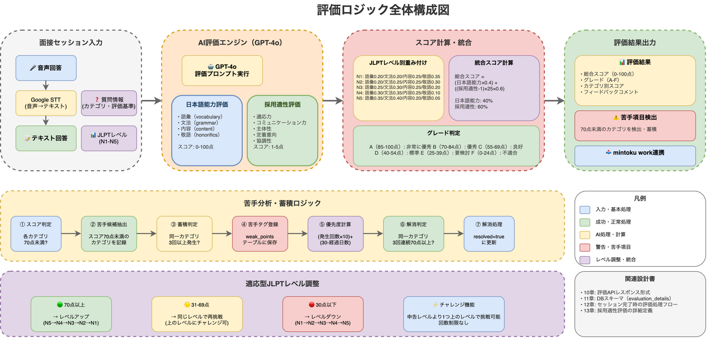
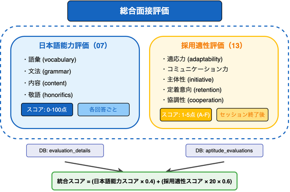

# 7. JLPTレベル別評価ロジック（日本語能力評価）

## 7.0 本設計書の位置づけ

### 7.0.1 評価体系の全体像

> **※ 本節は評価体系の正式定義です。他設計書からはこちらを参照してください。**

本システムでは、面接評価を以下の2つの評価軸で実施する:

| 評価種別 | 設計書 | 評価対象 | スコア範囲 | 評価タイミング |
|---------|--------|---------|----------|--------------|
| **日本語能力評価** | 本章 | 語彙・文法・内容・敬語 | 0-100点 | 各回答ごとにGPT-4oで自動評価 |
| **採用適性評価** | 13章 | 適応力・コミュニケーション力・主体性・定着意向・協調性 | 1-5点 | セッション終了後に総合評価 |



### 7.0.2 本設計書の役割

本設計書は「**日本語能力評価**」を定義する。具体的には:
- 外国人求職者の日本語運用能力をGPT-4oで自動評価
- JLPTレベル別の評価基準・重み付けを設定
- 苦手項目（語彙・文法・内容・敬語）の検出・蓄積ロジック

採用適性評価については13章を参照。

---

## 7.1 評価基準

| レベル | 評価の重点項目 | AIによる主なチェック項目                             |
| ------ | -------------- | ---------------------------------------------------- |
| N1/N2  | ビジネス即戦力 | 尊敬・謙譲語の使い分け、論理的思考、逆質問の妥当性   |
| N3     | 実務・接客対応 | 丁寧語（です・ます）の維持、質問の意図解釈、定型表現 |
| N4/N5  | 基本意思疎通   | 基本挨拶、語順の正しさ、聞き取りの可否               |

## 7.2 評価カテゴリ

| カテゴリ | 英語名 | 説明 |
|---------|--------|------|
| 語彙 | vocabulary | 適切な語彙の選択、語彙の豊富さ |
| 文法 | grammar | 文法の正確性、文構造の適切さ |
| 内容 | content | 回答の論理性、質問への適切な応答 |
| 敬語 | honorifics | 敬語の正確な使用、場面に応じた使い分け |

## 7.3 スコアリング計算式

### JLPTレベル別重み付け（正式定義）

> **※ 本節がスコア重み付けの正式定義です。実装時は必ずこちらを参照してください。**

| レベル | 語彙 | 文法 | 内容 | 敬語 |
|--------|------|------|------|------|
| N1 | 0.20 | 0.20 | 0.25 | 0.35 |
| N2 | 0.20 | 0.25 | 0.25 | 0.30 |
| N3 | 0.25 | 0.30 | 0.25 | 0.20 |
| N4 | 0.30 | 0.35 | 0.25 | 0.10 |
| N5 | 0.35 | 0.40 | 0.20 | 0.05 |

### 総合スコア計算式

JLPTレベル別重み付けを適用した総合スコア計算:

```
総合スコア = (語彙スコア × 語彙重み) + (文法スコア × 文法重み) + (内容スコア × 内容重み) + (敬語スコア × 敬語重み)
```

例: N1の場合
```
総合スコア = (語彙スコア × 0.20) + (文法スコア × 0.20) + (内容スコア × 0.25) + (敬語スコア × 0.35)
```

## 7.4 GPT-4o評価プロンプト

### システムプロンプト

```
あなたは日本語能力試験（JLPT）の評価専門家です。
外国人求職者の面接練習における回答を評価し、改善点を具体的にフィードバックします。

評価対象者のJLPTレベル: {jlpt_level}
評価基準:
1. 語彙（vocabulary）: 適切な語彙選択、語彙の豊富さ、専門用語の使用
2. 文法（grammar）: 文法の正確性、文構造、接続表現の適切さ
3. 内容（content）: 質問への適切な応答、論理性、具体例の使用
4. 敬語（honorifics）: 尊敬語・謙譲語・丁寧語の正確な使い分け

出力形式はJSON形式で、以下の構造に従ってください。
```

### ユーザープロンプト（回答評価時）

```
以下の面接質問に対する回答を評価してください。

【質問】
{question_text}

【回答】
{answer_text}

【評価基準】
{evaluation_criteria}

以下のJSON形式で回答してください:
{
  "scores": {
    "vocabulary": <0-100の整数>,
    "grammar": <0-100の整数>,
    "content": <0-100の整数>,
    "honorifics": <0-100の整数>
  },
  "feedback": {
    "vocabulary": "<具体的なフィードバック>",
    "grammar": "<具体的なフィードバック>",
    "content": "<具体的なフィードバック>",
    "honorifics": "<具体的なフィードバック>"
  },
  "weak_points": [
    {
      "category": "<カテゴリ>",
      "description": "<問題点の説明>",
      "example": "<具体例>",
      "suggestion": "<改善提案>"
    }
  ],
  "overall_feedback": "<全体的な総評>"
}
```

## 7.5 苦手分析の仕組み

### 苦手項目検出アルゴリズム

1. **解析**: 音声データをGoogle STTでテキスト化し、GPT-4oが4指標でスコアリング
2. **検出**: スコアが閾値（70点）未満のカテゴリを苦手候補として抽出
3. **蓄積**: 同一カテゴリの苦手が3回以上発生した場合、苦手タグとしてDBに記録
4. **優先度計算**: 発生頻度と直近発生日から優先度を算出
5. **最適化**: 次回セッション開始時、苦手タグに関連する質問やアドバイスをAIが優先的に選定

### 優先度計算式

```
優先度スコア = (発生回数 × 10) + (30 - 最終発生からの日数)

優先度判定:
- high: 優先度スコア >= 50
- medium: 優先度スコア >= 25
- low: 優先度スコア < 25
```

### 苦手項目の解消条件

> **注意**: 検出閾値（70点未満）と解消閾値を一致させ、整合性を確保する。

- 同一カテゴリで**3回連続70点以上**を取得
- 解消後は `resolved = true` に更新

#### 苦手検出・解消のフロー

| 状態 | 条件 | 次の状態 |
|------|------|----------|
| 正常 | スコア70点未満が3回発生 | 苦手（タグ登録） |
| 苦手 | スコア70点以上が3回連続 | 解消（resolved = true） |
| 解消済み | スコア70点未満が3回再発生 | 苦手（タグ再登録） |

## 7.6 評価フロー

```
1. 面接セッション完了
   ↓
2. 各回答のテキストを収集
   ↓
3. GPT-4oに評価リクエスト（バッチ処理）
   ↓
4. 各回答のスコア・フィードバックを取得
   ↓
5. セッション全体の総合スコアを計算
   ↓
6. 苦手項目を検出・更新
   ↓
7. 評価結果をDB保存（evaluation_details テーブル）
   ↓
8. 採用適性評価と統合してmintoku workへ結果送信
```

## 7.7 採用適性評価との統合

### 7.7.1 統合評価の構成

セッション完了時、日本語能力評価と採用適性評価を統合した総合評価を生成する。



### 7.7.2 統合スコアの計算方法

> **注意**: 統合スコアの計算方法はこのセクションで定義する。
> 12章、13章ではこのセクションを参照すること。

```
総合スコア（0-100点）= (日本語能力スコア × 0.4) + ((採用適性スコア - 1) × 25 × 0.6)
```

#### 計算式の導出

| 評価種別 | 元のスケール | 正規化後（0-100点） |
|---------|-------------|-------------------|
| 日本語能力スコア | 0-100点 | そのまま使用 |
| 採用適性スコア | 1-5点 | `(スコア - 1) × 25` → 0-100点 |

#### 検証

| 入力 | 計算 | 結果 |
|------|------|------|
| 日本語能力: 0点, 採用適性: 1点 | `(0 × 0.4) + ((1-1) × 25 × 0.6)` | 0点（最小） |
| 日本語能力: 100点, 採用適性: 5点 | `(100 × 0.4) + ((5-1) × 25 × 0.6)` | 40 + 60 = 100点（最大） |
| 日本語能力: 75点, 採用適性: 4点 | `(75 × 0.4) + ((4-1) × 25 × 0.6)` | 30 + 45 = 75点 |

#### 総合グレード判定

> **※ 本表はグレード判定の正式定義です。他設計書からはこちらを参照してください。**

| グレード | 総合スコア範囲 | ラベル | 推奨アクション |
|---------|--------------|-------|--------------|
| A | 85-100点 | 非常に優秀 | 即採用を強く推奨 |
| B | 70-84点 | 優秀 | 採用を推奨 |
| C | 55-69点 | 良好 | 採用を検討 |
| D | 40-54点 | 標準 | 条件付きで採用を検討 |
| E | 25-39点 | 要検討 | 再面接または不採用を検討 |
| F | 0-24点 | 不適合 | 不採用を推奨 |

### 7.7.3 DBテーブルの対応

| 評価種別 | 保存先テーブル | カテゴリ値 |
|---------|--------------|----------|
| 日本語能力評価 | evaluation_details | vocabulary, grammar, content, honorifics |
| 採用適性評価 | aptitude_evaluations | adaptability, communication, initiative, retention, cooperation |

### 7.7.4 mintoku workへの送信データ

両評価を統合したデータをmintoku workに送信する。詳細は10章 10.6節を参照。

---

## 7.8 関連設計書

| 設計書 | 関連内容 |
|--------|---------|
| 10章 | 評価APIレスポンス形式、mintoku work連携API |
| 11章 | evaluation_details, aptitude_evaluationsテーブル |
| 12章 | セッション完了時の評価処理フロー |
| 13章 | 採用適性評価の詳細定義 |

---

## 7.9 JLPTレベル乖離検出

### 7.9.1 目的

申告されたJLPTレベルと実際の面接評価スコアを比較し、能力の乖離を検出する。
これにより、採用担当者が適切な判断を行えるよう支援する。

### 7.9.2 期待スコア閾値と乖離判定

> **注意**: このセクションは「申告レベルとの乖離を検出する」ための閾値を定義する。
> スコアからの「推定レベル算出」については7.9.5節を正式な定義として参照すること。

| 申告レベル | 期待最低スコア | 乖離判定閾値 |
|-----------|---------------|-------------|
| N1 | 80点 | < 70点で警告 |
| N2 | 70点 | < 60点で警告 |
| N3 | 60点 | < 50点で警告 |
| N4 | 50点 | < 40点で警告 |
| N5 | 40点 | < 30点で警告 |

### 7.9.3 乖離深刻度

| 深刻度 | 条件 | 対応 |
|--------|------|------|
| none | スコアが期待閾値以上 | 問題なし |
| minor | 期待閾値 - 10点以内 | 情報提供のみ |
| major | 期待閾値 - 20点以内 | Warning表示 |
| critical | 期待閾値 - 20点超 | Red Flag、再評価推奨 |

### 7.9.4 検出ロジック

```typescript
interface LevelMismatchResult {
  detected: boolean;
  declared_level: string;        // 申告レベル（N1-N5）
  actual_score: number;          // 実際の日本語能力スコア（0-100）
  estimated_level: string;       // 推定レベル（N1-N5 or "N5未満"）
  gap_severity: 'none' | 'minor' | 'major' | 'critical';
  evidence: string[];            // 乖離の根拠となるスコア詳細
  recommendation: string;        // 推奨アクション
}
```

### 7.9.5 単一セッション推定レベル算出ロジック

> **用語の区別**:
> - **単一セッション推定レベル**: 本節で定義。1回のセッションスコアから算出する簡易推定。
> - **総合推定実力レベル**: 7.11.2節で定義。複数セッションの履歴から算出する総合的な推定。

日本語能力スコア（0-100点）から単一セッション推定レベルを算出：

| スコア範囲 | 推定レベル |
|-----------|----------|
| 80-100点 | N1相当 |
| 70-79点 | N2相当 |
| 60-69点 | N3相当 |
| 50-59点 | N4相当 |
| 40-49点 | N5相当 |
| 0-39点 | N5未満 |

### 7.9.6 Warning Signsとの連携

乖離深刻度が`major`または`critical`の場合、Warning Signs（13章参照）として記録：

- **major**: 注意レベル（Warning）として記録
- **critical**: 即確認レベル（Red Flag）として記録

---

## 7.10 適応型JLPTレベル調整

### 7.10.1 概要

ユーザーの面接評価スコアに基づいて、次回の面接で使用するJLPTレベルを自動調整する機能。
これにより、ユーザーの実力に合った難易度で練習を継続できる。

### 7.10.2 レベル調整ルール

| 評価スコア | 自動調整 | ユーザー選択オプション |
|-----------|----------|----------------------|
| **70点以上** | レベルを上げる（N5→N4→N3→N2→N1） | - |
| **31〜69点** | 同じレベルで再挑戦（推奨） | 「上のレベルにチャレンジ」ボタンで任意に上げられる |
| **30点以下** | レベルを下げる（N1→N2→N3→N4→N5） | - |

#### 境界条件

- N1で70点以上: N1を維持（上限）
- N5で30点以下: N5を維持（下限）

### 7.10.3 フィードバック画面のボタン表示

| 評価スコア | 現在レベル | 表示ボタン | アクション |
|-----------|-----------|-----------|----------|
| **70点以上** | N2〜N5 | 「N○にチャレンジ！」 | 自動で1つ上のレベルに移行 |
| **70点以上** | N1 | 「N1で練習を続ける」 | N1を維持（最高レベルのため） |
| **31〜69点** | 全レベル | 「同じレベルで再挑戦」＋「上のレベルにチャレンジ」 | ユーザーが選択 |
| **30点以下** | N2〜N1 | 「N○で練習する」 | 自動で1つ下のレベルに移行 |
| **30点以下** | N5 | 「N5で練習を続ける」 | N5を維持（最低レベルのため） |

### 7.10.4 チャレンジ機能

申告レベルより1つ上のレベルで最初から挑戦できる「チャレンジ」機能を提供。

#### チャレンジの条件

| 項目 | 詳細 |
|------|--------|
| 回数制限 | **なし**（何度でも挑戦可能） |
| 対象外レベル | N1（すでに最高レベル） |

#### チャレンジのUI表示

- 面接開始画面に「N○にチャレンジ」ボタンを表示
- チャレンジ中は「チャレンジ中」バッジを表示

### 7.10.5 平均スコア方式（最終評価）

同じレベルで複数回受験した場合、**平均スコア**を最終評価として採用。

#### 表示内容

| 項目 | 説明 |
|------|------|
| 最終評価（平均） | 同一レベルでの全セッションの平均スコア |
| 受験回数 | 同一レベルでのセッション数 |
| 最高点 | 同一レベルでの最高スコア |
| 最低点 | 同一レベルでの最低スコア |

#### 計算式

```
平均スコア = Σ(各セッションのスコア) / セッション数
```

### 7.10.6 状態管理

#### データ構造

```typescript
interface AdaptiveLevelState {
  /** ユーザーが最初に申請したレベル */
  declaredLevel: JLPTLevel;
  /** 現在のチャレンジレベル */
  currentLevel: JLPTLevel;
  /** セッション履歴 */
  sessionHistory: SessionResult[];
  /** 最新の調整方向 */
  adjustmentDirection: 'up' | 'down' | 'stable';
  /** チャレンジ枠で挑戦中かどうか */
  isChallengeMode: boolean;
}

interface SessionResult {
  level: JLPTLevel;
  score: number;
  timestamp: Date;
  isChallengeSession?: boolean;
}
```

#### 永続化

##### DBとの関係

> **正式なデータソース**: `interview_sessions`テーブル（11章参照）

| 保存先 | 役割 | データ |
|--------|------|--------|
| **DB（正）** | 永続的な履歴管理 | `interview_sessions.jlpt_level`, `interview_sessions.is_challenge` |
| **LocalStorage（キャッシュ）** | オフライン時の一時保存、UI高速化 | AdaptiveLevelState全体 |

##### 同期ルール

1. セッション完了時: DBに保存 → LocalStorageを更新
2. アプリ起動時: DBから最新データを取得 → LocalStorageを同期
3. オフライン時: LocalStorageから読み取り（次回オンライン時にDBと同期）

##### LocalStorageの用途

- ブラウザを閉じても履歴を一時保持
- オフライン時のフォールバック
- UI表示の高速化（DB問い合わせ前の仮表示）

### 7.10.7 レベル調整ロジック

```typescript
function calculateNextLevel(
  currentLevel: JLPTLevel,
  score: number
): { nextLevel: JLPTLevel; direction: 'up' | 'down' | 'stable' } {
  const levels: JLPTLevel[] = ['N5', 'N4', 'N3', 'N2', 'N1'];
  const currentIndex = levels.indexOf(currentLevel);

  // 70点以上: レベルを上げる
  if (score >= 70 && currentIndex < 4) {
    return { nextLevel: levels[currentIndex + 1], direction: 'up' };
  }

  // 30点以下: レベルを下げる
  if (score <= 30 && currentIndex > 0) {
    return { nextLevel: levels[currentIndex - 1], direction: 'down' };
  }

  // 31〜69点: 同じレベル
  return { nextLevel: currentLevel, direction: 'stable' };
}
```

---

## 7.11 企業向け統合評価

### 7.11.1 概要

チャレンジ枠での挑戦結果を含め、ユーザーの日本語能力を総合的に評価し、企業向けの情報として提供する機能。外国人求職者の「実力レベル」を特定し、企業が採用判断に活用できる形式でレポートを生成する。

### 7.11.2 総合推定実力レベルの算出ロジック

> **用語の区別**:
> - **単一セッション推定レベル**: 7.9.5節で定義。1回のセッションスコアから算出する簡易推定。
> - **総合推定実力レベル**: 本節で定義。複数セッションの履歴から算出する総合的な推定。

| 条件 | 推定実力レベル | 判定理由 |
|------|--------------|---------|
| 申告レベルで80点以上 & 上位チャレンジ70点以上 | 上位レベル相当 | 上位レベルでも合格水準 |
| 申告レベルで80点以上 & 上位チャレンジ未受験 | 上位レベル相当（推定） | スコアから推定 |
| 申告レベルで70-79点 | 申告レベル相当 | 申告通りの実力 |
| 申告レベルで50-69点 | 申告レベル相当（下位寄り） | やや苦手あり |
| 申告レベルで50点未満 | 下位レベル相当 | 申告より低い可能性 |

#### 推定ロジックの実装

```typescript
function calculateEstimatedLevel(
  declaredLevel: JLPTLevel,
  sessionHistory: SessionResult[]
): { estimatedLevel: JLPTLevel | 'below_N5'; reason: string } {
  // 申告レベルでの平均スコアを計算
  const declaredLevelSessions = sessionHistory.filter(
    (s) => s.level === declaredLevel && !s.isChallengeSession
  );
  const declaredAvgScore = declaredLevelSessions.length > 0
    ? average(declaredLevelSessions.map(s => s.score))
    : null;

  // チャレンジセッションの最高スコアを取得
  const challengeSessions = sessionHistory.filter(s => s.isChallengeSession);
  const challengeHighScore = challengeSessions.length > 0
    ? Math.max(...challengeSessions.map(s => s.score))
    : null;

  // 判定ロジック
  if (declaredAvgScore >= 80 && challengeHighScore >= 70) {
    return { estimatedLevel: higherLevel, reason: '上位レベルでも合格水準' };
  }
  // ... 以下、条件に応じた判定
}
```

### 7.11.3 業務適性判定の基準

| 業務レベル | 必要JLPT | 判定基準 |
|-----------|---------|---------|
| 単純作業 | N5相当 | N5で70点以上 or N4以上で合格 |
| 基本接客 | N4相当 | N4で70点以上 or N3以上で合格 |
| 一般業務 | N3相当 | N3で70点以上 or N2以上で合格 |
| ビジネス敬語 | N2相当 | N2で70点以上 or N1で合格 |
| 高度業務 | N1相当 | N1で70点以上 |

#### 判定ステータス

| ステータス | アイコン | 説明 |
|-----------|---------|------|
| capable | ✅ | 十分対応可能 |
| needs_practice | ⚠️ | 対応可能（要練習） |
| not_verified | ❓ | 未検証 |

### 7.11.4 データ構造

#### 企業向け統合評価レポート

```typescript
interface EnterpriseEvaluationReport {
  // レポート生成日時
  generatedAt: string;

  // 1. 推定実力レベル
  declaredLevel: JLPTLevel;
  estimatedLevel: JLPTLevel | 'below_N5';
  estimationDirection: 'higher' | 'same' | 'lower';
  estimationReason: string;

  // 2. レベル別パフォーマンス
  levelPerformances: LevelPerformance[];

  // 3. 業務適性判定
  jobSuitability: JobSuitability;

  // 4. 詳細スコア
  detailedScores: CategoryScores;
  weakPoints: WeakPoint[];

  // セッションサマリー
  totalSessions: number;
  totalChallengeSessions: number;
}
```

#### 面談結果データ（JSON形式、時系列順）

```typescript
interface InterviewResultData {
  userId: string;
  lastUpdatedAt: string;
  declaredLevel: JLPTLevel;
  sessions: InterviewSessionResult[];  // 時系列順（古い順）
  enterpriseReport: EnterpriseEvaluationReport | null;
}

interface InterviewSessionResult {
  sessionId: string;
  conductedAt: string;
  level: JLPTLevel;
  isChallengeSession: boolean;
  totalScore: number;
  categoryScores: CategoryScores;
  categoryFeedback: CategoryFeedback;
  weakPoints: WeakPointDetection[];
  overallFeedback: string;
}
```

### 7.11.6 企業が得られる価値

| 企業の疑問 | レポートの回答 |
|-----------|--------------|
| 「この人の日本語力は？」 | 推定実力レベル（N1〜N5または未満）で明示 |
| 「申告N3は正確？」 | 推定方向（⬆️⬇️➡️）と判定根拠で確認可能 |
| 「どの業務を任せられる？」 | 業務適性判定（✅⚠️❓）で判断可能 |
| 「具体的な弱点は？」 | 詳細スコアと苦手項目で確認可能 |

### 7.11.7 検証シナリオ

#### シナリオ1: N3申告 → N3で85点 → N2チャレンジで72点

```json
{
  "declaredLevel": "N3",
  "estimatedLevel": "N2",
  "estimationDirection": "higher",
  "estimationReason": "N3で平均85点、チャレンジN2で72点を達成",
  "jobSuitability": {
    "basicService": "capable",
    "generalWork": "capable",
    "businessHonorifics": "needs_practice",
    "advancedWork": "not_verified"
  }
}
```

#### シナリオ2: N3申告 → N3で60点

```json
{
  "declaredLevel": "N3",
  "estimatedLevel": "N3",
  "estimationDirection": "same",
  "estimationReason": "N3で平均60点（やや苦手あり）",
  "jobSuitability": {
    "basicService": "capable",
    "generalWork": "needs_practice",
    "businessHonorifics": "not_verified",
    "advancedWork": "not_verified"
  }
}
```

#### シナリオ3: N3申告 → N3で40点

```json
{
  "declaredLevel": "N3",
  "estimatedLevel": "N4",
  "estimationDirection": "lower",
  "estimationReason": "N3で平均40点のため、N4相当と推定",
  "jobSuitability": {
    "basicService": "needs_practice",
    "generalWork": "not_verified",
    "businessHonorifics": "not_verified",
    "advancedWork": "not_verified"
  }
}
```

### 7.11.8 関連ファイル

| ファイル | 役割 |
|----------|------|
| `poc/src/types/interview.ts` | 型定義（EnterpriseEvaluationReport等） |
| `poc/src/hooks/useAdaptiveLevel.ts` | 推定ロジック・レポート生成 |
| `poc/src/components/FeedbackDisplay.tsx` | 企業向けレポートUI |
