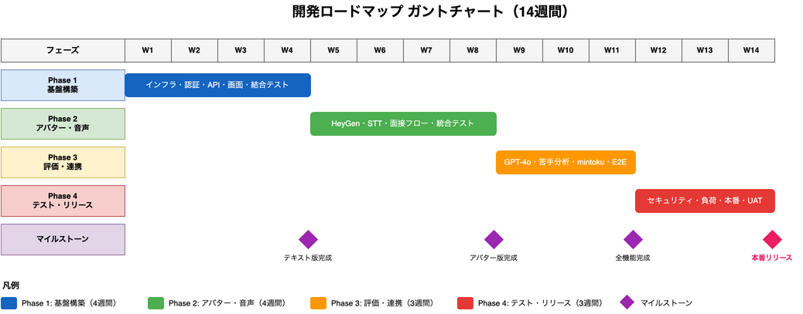

# 8. 開発ロードマップ

## 8.1 フェーズ概要

| フェーズ | 内容 | 期間 | 状態 |
|---------|------|------|------|
| Phase 1 | 基盤構築・認証・基本画面 | 4週間 | ✅ 完了（残タスクあり） |
| Phase 2 | HeyGenアバター・音声認識統合 | 4週間 | 🔄 進行中（70%） |
| Phase 3 | 評価機能・苦手分析・外部連携 | 3週間 | 🔄 進行中（50%） |
| Phase 4 | テスト・本番リリース準備 | 3週間 | 未実施 |

**合計: 14週間（約3.5ヶ月）**

### ガントチャート



---

## 8.2 Phase 1: 基盤構築（4週間） ✅ 完了

### マイルストーン

| 週 | 目標 | 状態 |
|----|------|------|
| Week 1 | 開発環境構築、DB設計、CI/CD構築 | ✅ 完了 |
| Week 2 | 認証基盤（SSO連携）、バックエンドAPI基本実装 | ✅ 完了 |
| Week 3 | フロントエンド基本画面実装（テキストベース） | ✅ 完了 |
| Week 4 | 結合テスト、バグ修正 | ✅ 完了 |

### タスク詳細

**インフラ・環境構築**
- [x] 開発環境Docker化
- [x] AWSリソース構築（EC2, RDS, S3, ElastiCache）
- [x] CI/CDパイプライン構築（GitHub Actions）
- [x] PostgreSQLスキーマ作成（11_データベーススキーマ参照）
- [x] Supabase環境構築・認証設定

**認証基盤**
- [x] mintoku work SSO連携（OAuth 2.0 / OpenID Connect）
- [x] JWT認証実装
- [x] セキュリティ設定（HTTPS、CORS、CSP）
- [x] SSOコールバックAPI実装

**バックエンドAPI**
- [x] FastAPIプロジェクト初期設定
- [x] 認証API（SSO連携、トークンリフレッシュ、ログアウト）
- [x] セッションAPI（開始、取得、回答送信、完了）
- [x] スクリプトAPI（一覧取得、詳細取得）
- [x] 質問管理API（CRUD、検索、インポート/エクスポート）
- [x] 全データベースモデル実装（User, Session, Evaluation, WeakPoint等）
- [x] シードデータ投入（60問の質問バンク、7業界マスタ）

**フロントエンド（ユーザー向け5画面）**
- [x] React (Vite) プロジェクト初期設定
- [x] SSOログイン画面（フォールバック用）
- [x] ホーム画面（ダッシュボード、ナビゲーション）
- [x] 面接練習画面（テキストベース版）
- [x] フィードバック画面（スコア表示、改善ポイント）
- [x] 学習進捗画面（グラフ、苦手項目）
- [x] ボトムナビゲーション
- [x] レスポンシブ対応（モバイル優先）

**管理画面**
- [x] 質問管理（CRUD、検索、フィルタ）
- [x] CSVインポート/エクスポート
- [x] ユーザー分析画面（簡易版）

**学習計画機能（12.10節対応）** ⚠️ 追加タスク
- [x] 学習ステップテンプレートJSON作成（learning_step_templates.json）
- [ ] 学習計画モデル実装（LearningPlan, LearningStep）
- [ ] 認証時の業界連携・学習計画生成ロジック
- [ ] 学習計画API（取得、ステップ完了更新）

**テスト（Phase 1）**
- [ ] ユニットテスト（バックエンド）
- [ ] ユニットテスト（フロントエンド）
- [x] 結合テスト（API + 画面）

---

## 8.3 Phase 2: HeyGenアバター・音声認識統合（4週間） 🔄 進行中

### マイルストーン

| 週 | 目標 | 状態 |
|----|------|------|
| Week 5 | HeyGen SDK統合、アバター表示 | ✅ 完了 |
| Week 6 | Google STT統合、リアルタイム文字起こし | 🔄 進行中 |
| Week 7 | 面接フロー完成（質問→回答ループ） | ✅ 完了 |
| Week 8 | エラーハンドリング、UI/UX改善、統合テスト | 🔄 進行中 |

### タスク詳細

**HeyGen Streaming Avatar統合**
- [x] HeyGen Streaming Avatar SDK導入
- [x] WebRTCセッション管理
- [x] アバター発話制御（TaskType.REPEAT）
- [x] 発話完了イベントハンドリング
- [x] フォールバック処理（テキストモードへの切替）
- [x] D-ID代替アバター対応
- [ ] **JLPTレベル別話速調整（JLPT_VOICE_RATE）** ⚠️ 未実装（12.2節参照）

**Google Cloud STT統合**
- [ ] Google Cloud STT設定・認証 ⚠️ **完全未実装**
- [ ] WebSocket音声ストリーミング
- [x] リアルタイム文字起こし表示（UIのみ）
- [x] 無音検出・自動停止（5秒）
- [x] テキスト入力フォールバック

**面接フロー制御**
- [x] 質問→回答ループ実装
- [x] スキップ機能
- [x] セッション状態管理（進行中、完了、中断）
- [x] 接続ステータス表示（接続中/接続処理中/未接続）
- [x] 面接状態マシン（useInterviewStateMachine）
- [x] フォローアップ質問管理

**チャレンジ機能（6.2.3節、12.9.3節対応）** ⚠️ 追加タスク
- [ ] チャレンジ選択画面UI実装
- [ ] チャレンジ種別設定フロー
- [ ] LocalStorageチャレンジ状態管理・復旧ロジック（12.9.7節）

**エラーハンドリング**
- [x] アバター接続失敗時のリトライ・フォールバック
- [x] マイク許可なし時の誘導ダイアログ
- [x] 音声認識失敗時のテキスト入力切替
- [x] ネットワーク切断時の再接続試行

**テスト（Phase 2）**
- [ ] ユニットテスト（新機能）
- [ ] 統合テスト（HeyGen + STT + 面接フロー）
- [ ] ブラウザ互換性テスト

---

## 8.4 Phase 3: 評価機能・苦手分析・外部連携（3週間） 🔄 進行中

### マイルストーン

| 週 | 目標 | 状態 |
|----|------|------|
| Week 9 | GPT-4o評価ロジック実装（日本語能力・採用適性） | 🔄 進行中 |
| Week 10 | 苦手分析機能、学習進捗画面連携 | 🔄 進行中 |
| Week 11 | mintoku work API連携、E2Eテスト | 未実施 |

### タスク詳細

**GPT-4o評価機能**
- [x] 評価モデル定義（Evaluation, EvaluationResult）
- [ ] 評価API実装（GPT-4o実連携） ⚠️ **ロジック未実装**
- [x] 日本語能力評価スキーマ（語彙・文法・内容・敬語）
- [x] 採用適性評価スキーマ（適応力・コミュニケーション力・主体性・定着意向・協調性）
- [x] JLPTレベル別重み付け定義
- [ ] フィードバック生成ロジック
- [ ] JLPTレベル乖離検出（7.9節参照）
- [x] 評価結果DB保存

**適応型JLPTレベル調整（7.10節、12.9節対応）** ⚠️ 追加タスク
- [ ] セッション中レベル自動調整ロジック
- [ ] レベル乖離検出後の質問難易度変更
- [ ] JLPTレベル推奨API

**苦手分析機能**
- [x] 苦手項目検出アルゴリズム定義（閾値70点未満）
- [x] 優先度計算定義（発生頻度 × 直近発生日）
- [x] 苦手タグの蓄積ロジック（3回以上で記録）
- [x] 解消条件判定定義（3回連続80点以上）
- [ ] 学習進捗画面への完全反映
- [x] WeakPointモデル実装

**企業向け統合評価レポート（7.11節対応）** ⚠️ 追加タスク
- [ ] 評価レポート生成API
- [ ] レポートPDF/Excel出力
- [ ] バッチ集計ロジック

**管理者向け詳細分析画面（6.3.5-6.3.6節対応）** ⚠️ 追加タスク
- [ ] 苦手項目詳細画面（6.3.6.1節）
- [ ] 練習履歴詳細画面（6.3.6.2節）
- [ ] ユーザー傾向分析グラフ

**mintoku work連携**
- [x] 連携フィールド定義（mintoku_synced, mintoku_synced_at）
- [ ] OAuth2 Client Credentials実装 ⚠️ **未実装**
- [ ] 結果送信API呼び出し（練習完了時）
- [ ] リトライ処理（指数バックオフ、最大3回）
- [ ] 同期ステータス管理
- [ ] エラーハンドリング・ログ記録

**テスト（Phase 3）**
- [ ] ユニットテスト（評価ロジック）
- [ ] 統合テスト（評価 + mintoku連携）
- [ ] E2Eテスト（全フロー通し）

---

## 8.5 Phase 4: テスト・本番リリース準備（3週間）

### マイルストーン

| 週 | 目標 | 状態 |
|----|------|------|
| Week 12 | セキュリティテスト、負荷テスト | 未実施 |
| Week 13 | 本番環境構築、監視設定 | 未実施 |
| Week 14 | 最終テスト、ドキュメント整備、リリース | 未実施 |

### タスク詳細

**セキュリティテスト**
- [ ] OWASP Top 10脆弱性チェック
- [ ] 認証・認可テスト
- [ ] 入力バリデーションテスト
- [ ] セキュリティ監査レポート作成

**負荷テスト**
- [ ] 同時100ユーザー目標
- [ ] HeyGen/STT同時接続テスト
- [ ] API応答時間測定
- [ ] ボトルネック特定・改善

**本番環境構築**
- [ ] 本番AWSリソース構築
- [ ] SSL証明書設定
- [ ] CloudWatch監視設定
- [ ] バックアップ設定
- [ ] アラート設定

**運用準備**
- [ ] 運用マニュアル作成
- [ ] 障害対応手順書
- [ ] ドキュメント整備
- [ ] リリースチェックリスト

**最終テスト**
- [ ] 本番環境での動作確認
- [ ] ユーザー受け入れテスト（UAT）
- [ ] 最終バグ修正

---

## 8.6 残タスク優先度一覧

| 優先度 | タスク | 理由 | フェーズ |
|-------|-------|-----|---------|
| 🔴 高 | Google Cloud STT統合 | 音声認識機能が完全に未実装 | Phase 2 |
| 🔴 高 | GPT-4o評価エンジン完成 | モデルのみで実ロジック未実装 | Phase 3 |
| 🔴 高 | 学習計画機能 | テンプレートはあるがモデル・API・UIが未実装 | Phase 1 |
| 🟡 中 | 適応型JLPTレベル調整 | フロントエンドにhookはあるが統合不足 | Phase 3 |
| 🟡 中 | mintoku API連携 | フィールドのみで実装未完了 | Phase 3 |
| 🟡 中 | HeyGen話速調整 | JLPT_VOICE_RATE定義あり、実装未完了 | Phase 2 |
| 🟢 低 | 企業向けレポート | 基本評価完成後に対応 | Phase 3 |
| 🟢 低 | 管理者詳細分析画面 | 簡易版は完成、拡張版は後続 | Phase 3 |

---

## 8.7 テスト戦略

### テスト種別と実施タイミング

| テスト種別 | 説明 | 実施フェーズ | 状態 |
|-----------|------|-------------|------|
| ユニットテスト | 関数・コンポーネント単位 | Phase 1-3（継続的） | 🔄 一部実施 |
| 結合テスト | API + 画面連携 | Phase 1 | ✅ 完了 |
| 統合テスト | 外部サービス連携 | Phase 2-3 | 未実施 |
| E2Eテスト | 全フロー通し | Phase 3 | 未実施 |
| セキュリティテスト | 脆弱性診断 | Phase 4 | 未実施 |
| 負荷テスト | 同時接続・性能 | Phase 4 | 未実施 |
| UAT | ユーザー受け入れ | Phase 4 | 未実施 |

### テストカバレッジ目標

| 対象 | 目標カバレッジ | 現状 |
|------|---------------|------|
| バックエンドAPI | 80%以上 | 未計測 |
| フロントエンドコンポーネント | 70%以上 | 未計測 |
| 評価ロジック | 90%以上 | 未計測 |

---

## 8.8 依存関係図

```
Phase 1 ✅ 完了
├── インフラ基盤 ✅
│   └── 認証基盤 ✅
│       └── バックエンドAPI ✅
│           └── フロントエンド基本画面 ✅
├── 学習計画機能 🔄（残タスク）
│   └── 学習ステップテンプレート ✅
│       └── 学習計画API・モデル ❌

Phase 2 🔄 進行中（70%）
├── HeyGen統合 ✅
│   ├── 話速調整 ❌
│   └── 面接フロー ✅
├── Google STT統合 ❌
│   └── 面接フロー（音声）❌
├── チャレンジ機能 ❌

Phase 3 🔄 進行中（50%）
├── GPT-4o評価 🔄
│   ├── 評価モデル ✅
│   └── 評価ロジック ❌
├── 苦手分析 🔄
│   ├── モデル ✅
│   └── 完全統合 ❌
├── 適応型レベル調整 ❌
├── 企業向けレポート ❌
├── mintoku work連携 ❌

Phase 4（Phase 3完了後）
├── セキュリティテスト
├── 負荷テスト
├── 本番環境構築
└── リリース
```

---

## 8.9 リスクと対策

| リスク | 影響 | 対策 | 状態 |
|--------|------|------|------|
| HeyGen API制限 | アバター表示不可 | テキストモードフォールバック実装 | ✅ 対策済 |
| STT精度不足 | 評価精度低下 | テキスト入力オプション追加 | ✅ 対策済 |
| GPT-4oコスト超過 | 運用費増大 | バッチ処理、キャッシュ活用 | 🔄 設計済 |
| mintoku work API仕様変更 | 連携失敗 | API バージョニング、互換層 | 未対応 |
| 開発遅延 | リリース遅延 | 週次進捗確認、バッファ期間確保 | 🔄 継続中 |
| セキュリティ脆弱性 | サービス停止 | Phase 4でのセキュリティ監査 | 未実施 |
| Google STT未実装 | 音声機能不可 | 代替STT検討（Web Speech API等） | ⚠️ 検討中 |

---

## 改訂履歴

| 日付 | バージョン | 内容 |
|------|-----------|------|
| 2025-01-30 | 1.0 | 初版作成 |
| 2026-02-01 | 2.0 | 全面改訂：タスクベースでフェーズ再構成、テスト戦略追加 |
| 2026-02-04 | 3.0 | 全面改訂：実装状況に合わせてフェーズ状態更新、学習計画機能・適応型レベル調整・企業向けレポート・チャレンジ機能追加、残タスク優先度一覧追加 |
