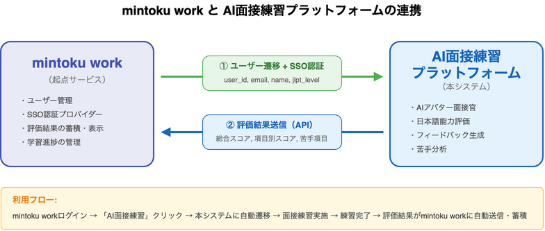

# 9. 外部API連携

## 9.1 OpenAI GPT-4o

- **用途**:
  - 日本語能力評価（語彙・文法・内容・敬語）→ 詳細は07_評価ロジック
  - 採用適性評価（適応力・コミュニケーション力・主体性・定着意向・協調性）→ 詳細は13_面接シナリオ設計
  - フィードバック生成、苦手分析
- **エンドポイント**: Chat Completions API
- **考慮事項**: レート制限、コスト管理

## 9.2 Google Cloud Speech-to-Text / Text-to-Speech

- **用途**: 音声認識（STT）、音声合成（TTS）
- **言語**: 日本語（ja-JP）
- **考慮事項**: 音声品質、レイテンシ

## 9.3 HeyGen Streaming Avatar

- **用途**: 動的アバター生成（リップシンク対応）、面接官アバター
- **SDK**: `@heygen/streaming-avatar`
- **選定理由**:
  - TaskType.REPEAT による正確なセリフ発話が可能
  - WebRTCストリーミングによる低レイテンシ
  - 日本語TTS品質が高い
  - SDK統合が容易（React対応）
- **考慮事項**: クレジット消費（約6クレジット/分）、月額$99〜

## 9.4 mintoku work（連携サービス）

本システムは「**mintoku work**」を起点とする。ユーザーはmintoku workから本システムに遷移して面接練習を行う。

### システム間の関係



### 受信（mintoku work → 本システム）

| 項目 | 内容 |
|------|------|
| 用途 | SSO認証、ユーザー情報取得 |
| 認証方式 | OAuth 2.0 / OpenID Connect |
| 取得情報 | user_id, email, name, organization, jlpt_level |
| 遷移方式 | トークン付きリンク（シームレス遷移） |

### 送信（本システム → mintoku work）

| 項目 | 内容 |
|------|------|
| 用途 | 面接練習の評価結果をmintoku workに反映 |
| エンドポイント | mintoku work側で用意するAPI |
| 送信タイミング | 練習完了時（リアルタイム） |
| 送信内容 | 総合スコア、グレード、日本語能力評価（語彙・文法・内容・敬語）、採用適性評価（適応力・コミュニケーション力・主体性・定着意向・協調性）、苦手項目、練習回数 |
| 認証 | API Key または OAuth2 Client Credentials |

> **評価体系について**
> 日本語能力評価（07_評価ロジック）と採用適性評価（13_面接シナリオ設計）の両方を送信する。
> 詳細なデータ形式は10_API仕様 10.6節を参照。

### 利用フロー

```
1. ユーザーがmintoku workにログイン
2. mintoku work内の「AI面接練習」をクリック
3. 本システムに自動ログイン（シームレス遷移）
4. 面接練習を実施
5. 練習完了 → 評価結果がmintoku workに自動送信
```
