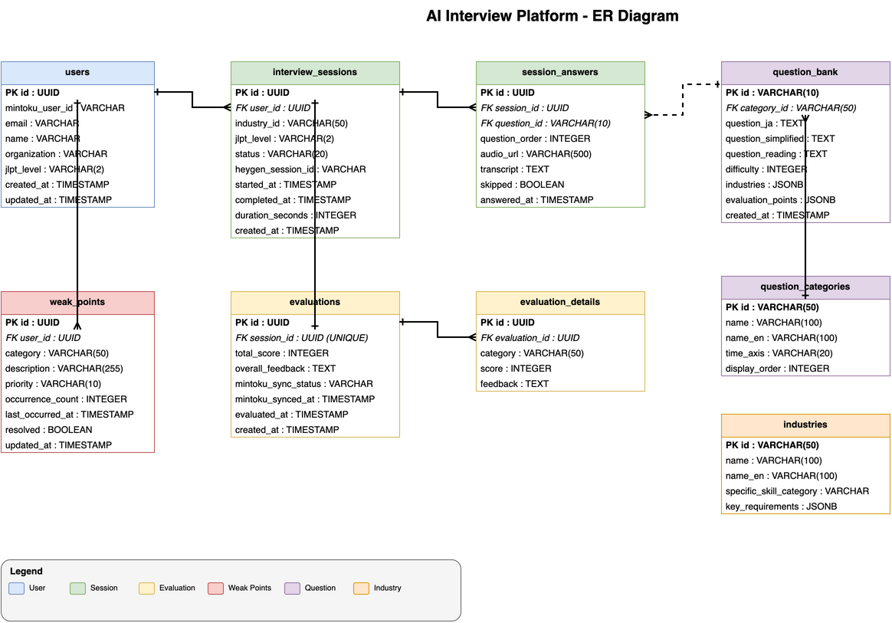

# 11. データベーススキーマ

## 11.1 テーブル一覧

| テーブル名 | 説明 |
|-----------|------|
| users | ユーザー情報（mintoku workからの連携データ含む） |
| interview_sessions | 面接セッション（練習単位） |
| session_answers | セッション内の各回答 |
| evaluations | 評価結果（セッション単位） |
| evaluation_details | 評価詳細（日本語能力評価の項目別スコア） |
| aptitude_evaluations | 採用適性評価（5つの評価軸） |
| weak_points | 苦手項目（ユーザー単位で蓄積） |
| scripts | 面接スクリプト（mintoku workから同期） |
| script_questions | スクリプト内の質問 |
| question_categories | 質問カテゴリマスタ |
| industries | 業界マスタ |
| question_bank | 質問バンク（50問の質問データ） |
| scenario_templates | シナリオテンプレート |
| scenario_template_questions | テンプレート-質問関連 |

## 11.2 ER図



## 11.3 テーブル定義

### users テーブル

| カラム名 | 型 | NULL | 説明 |
|---------|-----|------|------|
| id | UUID | NO | 主キー |
| mintoku_user_id | VARCHAR(255) | NO | mintoku work側のユーザーID（ユニーク） |
| email | VARCHAR(255) | NO | メールアドレス（ユニーク） |
| name | VARCHAR(255) | NO | 氏名 |
| organization | VARCHAR(255) | YES | 所属組織 |
| jlpt_level | VARCHAR(2) | YES | JLPTレベル（N1-N5） |
| created_at | TIMESTAMP | NO | 作成日時 |
| updated_at | TIMESTAMP | NO | 更新日時 |

### interview_sessions テーブル

| カラム名 | 型 | NULL | 説明 |
|---------|-----|------|------|
| id | UUID | NO | 主キー |
| user_id | UUID | NO | 外部キー → users.id |
| script_id | UUID | NO | 外部キー → scripts.id |
| status | VARCHAR(20) | NO | ステータス（in_progress, completed, abandoned） |
| heygen_session_id | VARCHAR(255) | YES | HeyGenセッションID |
| started_at | TIMESTAMP | NO | 開始日時 |
| completed_at | TIMESTAMP | YES | 完了日時 |
| duration_seconds | INTEGER | YES | 所要時間（秒） |
| created_at | TIMESTAMP | NO | 作成日時 |

### session_answers テーブル

| カラム名 | 型 | NULL | 説明 |
|---------|-----|------|------|
| id | UUID | NO | 主キー |
| session_id | UUID | NO | 外部キー → interview_sessions.id |
| question_id | UUID | NO | 外部キー → script_questions.id |
| question_order | INTEGER | NO | 質問順序 |
| audio_url | VARCHAR(500) | YES | 音声ファイルURL（S3） |
| transcript | TEXT | YES | 文字起こしテキスト |
| skipped | BOOLEAN | NO | スキップしたか（デフォルト: false） |
| answered_at | TIMESTAMP | NO | 回答日時 |
| created_at | TIMESTAMP | NO | 作成日時 |

### evaluations テーブル

| カラム名 | 型 | NULL | 説明 |
|---------|-----|------|------|
| id | UUID | NO | 主キー |
| session_id | UUID | NO | 外部キー → interview_sessions.id（ユニーク） |
| total_score | INTEGER | NO | 総合スコア（0-100） |
| overall_feedback | TEXT | YES | 総合フィードバック |
| mintoku_sync_status | VARCHAR(20) | NO | mintoku work同期ステータス（pending, synced, failed） |
| mintoku_synced_at | TIMESTAMP | YES | mintoku work同期日時 |
| evaluated_at | TIMESTAMP | NO | 評価実行日時 |
| created_at | TIMESTAMP | NO | 作成日時 |

### evaluation_details テーブル（日本語能力評価）

> **用途**: 日本語能力評価（07_評価ロジック）の項目別スコアを保存

| カラム名 | 型 | NULL | 説明 |
|---------|-----|------|------|
| id | UUID | NO | 主キー |
| evaluation_id | UUID | NO | 外部キー → evaluations.id |
| category | VARCHAR(50) | NO | 評価カテゴリ（vocabulary, grammar, content, honorifics） |
| score | INTEGER | NO | スコア（0-100） |
| feedback | TEXT | YES | カテゴリ別フィードバック |
| created_at | TIMESTAMP | NO | 作成日時 |

### aptitude_evaluations テーブル（採用適性評価）

> **用途**: 採用適性評価（13_面接シナリオ設計）の項目別スコアを保存

| カラム名 | 型 | NULL | 説明 |
|---------|-----|------|------|
| id | UUID | NO | 主キー |
| evaluation_id | UUID | NO | 外部キー → evaluations.id |
| category | VARCHAR(50) | NO | 評価カテゴリ（adaptability, communication, initiative, retention, cooperation） |
| score | DECIMAL(2,1) | NO | スコア（1.0-5.0） |
| feedback | TEXT | YES | カテゴリ別フィードバック |
| created_at | TIMESTAMP | NO | 作成日時 |

#### 評価カテゴリ対応表

| カテゴリID | 日本語名 | 重み |
|-----------|---------|-----|
| adaptability | 適応力 | 20% |
| communication | コミュニケーション力 | 25% |
| initiative | 主体性 | 20% |
| retention | 定着意向 | 20% |
| cooperation | 協調性 | 15% |

### weak_points テーブル

| カラム名 | 型 | NULL | 説明 |
|---------|-----|------|------|
| id | UUID | NO | 主キー |
| user_id | UUID | NO | 外部キー → users.id |
| category | VARCHAR(50) | NO | カテゴリ（日本語能力: vocabulary, grammar, content, honorifics） |
| description | VARCHAR(255) | NO | 苦手項目の説明 |
| priority | VARCHAR(10) | NO | 優先度（high, medium, low） |
| occurrence_count | INTEGER | NO | 発生回数 |
| last_occurred_at | TIMESTAMP | NO | 最終発生日時 |
| resolved | BOOLEAN | NO | 解決済みか（デフォルト: false） |
| created_at | TIMESTAMP | NO | 作成日時 |
| updated_at | TIMESTAMP | NO | 更新日時 |

### scripts テーブル

| カラム名 | 型 | NULL | 説明 |
|---------|-----|------|------|
| id | UUID | NO | 主キー |
| mintoku_script_id | VARCHAR(255) | NO | mintoku work側のスクリプトID（ユニーク） |
| title | VARCHAR(255) | NO | スクリプトタイトル |
| industry | VARCHAR(100) | YES | 業界 |
| job_type | VARCHAR(100) | YES | 職種 |
| jlpt_level | VARCHAR(2) | NO | 対象JLPTレベル |
| estimated_duration_minutes | INTEGER | YES | 想定所要時間（分） |
| is_active | BOOLEAN | NO | 有効か（デフォルト: true） |
| synced_at | TIMESTAMP | NO | mintoku workからの同期日時 |
| created_at | TIMESTAMP | NO | 作成日時 |
| updated_at | TIMESTAMP | NO | 更新日時 |

### script_questions テーブル

| カラム名 | 型 | NULL | 説明 |
|---------|-----|------|------|
| id | UUID | NO | 主キー |
| script_id | UUID | NO | 外部キー → scripts.id |
| order_number | INTEGER | NO | 質問順序 |
| question_text | TEXT | NO | 質問文 |
| expected_duration_seconds | INTEGER | YES | 想定回答時間（秒） |
| evaluation_criteria | JSONB | YES | 評価基準（JSONオブジェクト） |
| created_at | TIMESTAMP | NO | 作成日時 |

## 11.4 インデックス設計

| テーブル | インデックス | カラム | 目的 |
|---------|-------------|--------|------|
| users | idx_users_mintoku_id | mintoku_user_id | SSO認証時の検索 |
| users | idx_users_email | email | メールでの検索 |
| interview_sessions | idx_sessions_user_status | user_id, status | ユーザー別セッション検索 |
| interview_sessions | idx_sessions_completed | completed_at | 履歴表示用 |
| evaluations | idx_evaluations_sync | mintoku_sync_status | 同期バッチ処理用 |
| weak_points | idx_weakpoints_user | user_id, resolved | 苦手項目表示用 |
| aptitude_evaluations | idx_aptitude_eval | evaluation_id | 評価IDからの検索 |
| scripts | idx_scripts_jlpt | jlpt_level, is_active | レベル別スクリプト検索 |

## 11.5 シナリオ・質問バンク関連テーブル

### question_categories テーブル

質問カテゴリ（導入、過去、現在、未来、条件確認、クロージング）を管理するマスタテーブル。

| カラム名 | 型 | NULL | 説明 |
|---------|-----|------|------|
| id | VARCHAR(50) | NO | 主キー（例: introduction, past_experience） |
| name | VARCHAR(100) | NO | カテゴリ名（日本語） |
| name_en | VARCHAR(100) | NO | カテゴリ名（英語） |
| time_axis | VARCHAR(20) | YES | 時間軸（past, present, future, null） |
| duration_minutes | INTEGER | NO | 想定所要時間（分） |
| display_order | INTEGER | NO | 表示順序 |
| description | TEXT | YES | カテゴリの説明 |
| purpose | TEXT | YES | カテゴリの目的 |
| created_at | TIMESTAMP | NO | 作成日時 |
| updated_at | TIMESTAMP | NO | 更新日時 |

### industries テーブル

外国人採用の対象業界（介護、飲食、建設、製造、宿泊、農業、ビルクリーニング）を管理するマスタテーブル。

| カラム名 | 型 | NULL | 説明 |
|---------|-----|------|------|
| id | VARCHAR(50) | NO | 主キー（例: nursing_care, food_service） |
| name | VARCHAR(100) | NO | 業界名（日本語） |
| name_en | VARCHAR(100) | NO | 業界名（英語） |
| specific_skill_category | VARCHAR(100) | YES | 特定技能分野カテゴリ |
| description | TEXT | YES | 業界の説明 |
| key_requirements | JSONB | YES | 業界特有の要件（配列） |
| priority_evaluation_categories | JSONB | YES | 重点評価カテゴリ（配列） |
| common_job_titles | JSONB | YES | 一般的な職種名（配列） |
| physical_demands | VARCHAR(20) | YES | 身体的負荷レベル（low, medium, high, very_high） |
| communication_level_required | VARCHAR(2) | YES | 必要なJLPTレベル |
| additional_questions | JSONB | YES | 業界固有の追加質問（配列） |
| created_at | TIMESTAMP | NO | 作成日時 |
| updated_at | TIMESTAMP | NO | 更新日時 |

### question_bank テーブル

面接で使用する50問の質問を管理するテーブル。

| カラム名 | 型 | NULL | 説明 |
|---------|-----|------|------|
| id | VARCHAR(10) | NO | 主キー（例: Q01, Q02） |
| category_id | VARCHAR(50) | NO | 外部キー → question_categories.id |
| question_ja | TEXT | NO | 質問文（標準版） |
| question_simplified | TEXT | NO | 質問文（簡易版 N4-N5向け） |
| question_reading | TEXT | YES | ふりがな付き質問文 |
| difficulty | INTEGER | NO | 難易度（1-3） |
| industries | JSONB | NO | 対象業界（配列、allで全業界） |
| evaluation_points | JSONB | YES | 評価ポイント（配列） |
| follow_ups | JSONB | YES | フォローアップ質問（配列） |
| good_answer_indicators | JSONB | YES | 良い回答の指標（配列） |
| red_flags | JSONB | YES | 注意すべき回答パターン（配列） |
| is_ice_breaker | BOOLEAN | NO | アイスブレイク質問か（デフォルト: false） |
| is_condition_check | BOOLEAN | NO | 条件確認質問か（デフォルト: false） |
| is_closing_statement | BOOLEAN | NO | クロージング文か（デフォルト: false） |
| source | VARCHAR(100) | YES | 質問の出典 |
| created_at | TIMESTAMP | NO | 作成日時 |
| updated_at | TIMESTAMP | NO | 更新日時 |

### scenario_templates テーブル

業界・JLPTレベル別のシナリオテンプレートを管理するテーブル。

| カラム名 | 型 | NULL | 説明 |
|---------|-----|------|------|
| id | VARCHAR(50) | NO | 主キー（例: standard_45min, nursing_care_focused） |
| name | VARCHAR(100) | NO | テンプレート名（日本語） |
| name_en | VARCHAR(100) | NO | テンプレート名（英語） |
| description | TEXT | YES | テンプレートの説明 |
| duration_minutes | INTEGER | NO | 想定所要時間（分） |
| jlpt_levels | JSONB | NO | 対象JLPTレベル（配列） |
| industries | JSONB | NO | 対象業界（配列） |
| flow | JSONB | NO | シナリオフロー（各フェーズの質問ID等） |
| created_at | TIMESTAMP | NO | 作成日時 |
| updated_at | TIMESTAMP | NO | 更新日時 |

### scenario_template_questions テーブル

シナリオテンプレートと質問の関連を管理する中間テーブル。

| カラム名 | 型 | NULL | 説明 |
|---------|-----|------|------|
| id | UUID | NO | 主キー |
| template_id | VARCHAR(50) | NO | 外部キー → scenario_templates.id |
| question_id | VARCHAR(10) | NO | 外部キー → question_bank.id |
| phase | VARCHAR(50) | NO | シナリオフェーズ |
| order_in_phase | INTEGER | NO | フェーズ内での質問順序 |
| is_required | BOOLEAN | NO | 必須質問か（デフォルト: true） |
| notes | TEXT | YES | 質問時の注意事項 |
| created_at | TIMESTAMP | NO | 作成日時 |

## 11.6 シナリオ関連インデックス

| テーブル | インデックス | カラム | 目的 |
|---------|-------------|--------|------|
| question_bank | idx_qbank_category | category_id | カテゴリ別質問検索 |
| question_bank | idx_qbank_difficulty | difficulty | 難易度別検索 |
| scenario_templates | idx_templates_industry | industries | 業界別テンプレート検索 |
| scenario_template_questions | idx_stq_template | template_id | テンプレート別質問取得 |
| scenario_template_questions | idx_stq_question | question_id | 質問別テンプレート取得 |

## 11.7 データ整合性ルール

### 質問削除時の整合性管理

`session_answers.question_id` は `script_questions.id` を参照するため、質問の削除には特別な配慮が必要です。

#### 方針: 論理削除（物理削除禁止）

| ルール | 内容 |
|-------|------|
| 物理削除禁止 | 質問データは物理削除しない |
| 論理削除 | `is_deleted` フラグで管理 |
| 過去データ保護 | 回答データとの紐付けを維持 |
| バージョン管理 | 質問内容の変更履歴を保持 |

#### script_questions テーブルの追加カラム

| カラム名 | 型 | NULL | 説明 |
|---------|-----|------|------|
| is_deleted | BOOLEAN | NO | 論理削除フラグ（デフォルト: false） |
| deleted_at | TIMESTAMP | YES | 削除日時 |
| version | INTEGER | NO | バージョン番号（デフォルト: 1） |

#### question_bank テーブルの追加カラム

| カラム名 | 型 | NULL | 説明 |
|---------|-----|------|------|
| is_deleted | BOOLEAN | NO | 論理削除フラグ（デフォルト: false） |
| deleted_at | TIMESTAMP | YES | 削除日時 |
| version | INTEGER | NO | バージョン番号（デフォルト: 1） |

#### 外部キー制約設計

```sql
-- session_answersテーブルの外部キー制約
ALTER TABLE session_answers
ADD CONSTRAINT fk_session_answers_question
FOREIGN KEY (question_id) REFERENCES script_questions(id)
ON DELETE RESTRICT  -- 削除を禁止
ON UPDATE CASCADE;  -- ID変更時は連動

-- script_questionsテーブルの外部キー制約
ALTER TABLE script_questions
ADD CONSTRAINT fk_script_questions_script
FOREIGN KEY (script_id) REFERENCES scripts(id)
ON DELETE RESTRICT
ON UPDATE CASCADE;
```

#### 質問変更時のバージョン管理

質問内容を変更する場合、新しいバージョンを作成して過去データとの整合性を保持。

```sql
-- 質問更新時の処理
BEGIN TRANSACTION;

-- 現在の質問を論理削除
UPDATE question_bank
SET is_deleted = true, deleted_at = NOW()
WHERE id = 'Q01' AND is_deleted = false;

-- 新しいバージョンを作成
INSERT INTO question_bank (
    id, category_id, question_ja, question_simplified,
    difficulty, industries, version, created_at
) VALUES (
    'Q01', 'introduction', '更新後の質問文', '簡易版',
    1, '["all"]',
    (SELECT COALESCE(MAX(version), 0) + 1 FROM question_bank WHERE id = 'Q01'),
    NOW()
);

COMMIT;
```

#### 質問取得時のフィルタリング

```sql
-- アクティブな質問のみ取得
SELECT * FROM question_bank
WHERE is_deleted = false
ORDER BY category_id, id;

-- 特定時点の質問を取得（過去の回答データ参照用）
SELECT * FROM question_bank
WHERE id = 'Q01'
  AND created_at <= '2025-01-30T00:00:00Z'
  AND (deleted_at IS NULL OR deleted_at > '2025-01-30T00:00:00Z')
ORDER BY version DESC
LIMIT 1;
```

### 整合性チェックバッチ

定期的に整合性をチェックするバッチ処理を実行。

| チェック項目 | 頻度 | アラート条件 |
|-------------|------|-------------|
| 孤立した回答データ | 日次 | question_idが存在しない回答 |
| 削除済み質問の参照 | 日次 | 最近のセッションで削除済み質問を参照 |
| バージョン不整合 | 週次 | 同一IDで複数のアクティブバージョン |
