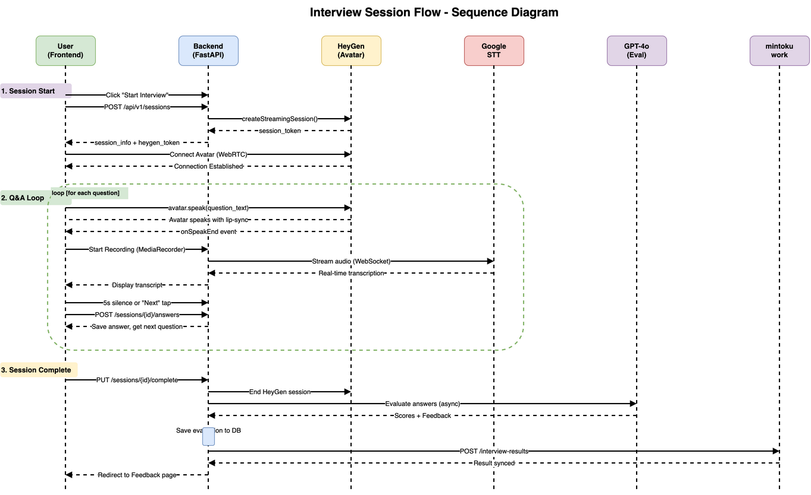
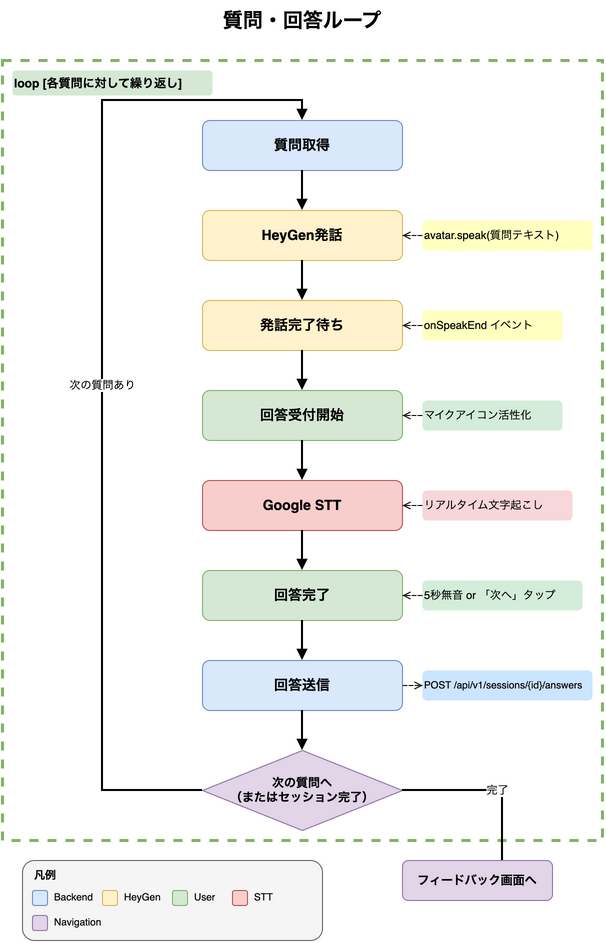

# 12. 面接フロー制御

## 12.1 面接セッション全体フロー



## 12.2 HeyGen Streaming Avatar統合

### セッション開始シーケンス

```
1. ユーザーが「面接を始める」をタップ
   ↓
2. フロントエンド → バックエンド: POST /api/v1/sessions
   ↓
3. バックエンド: 質問バンクから業界×JLPTレベルで質問選択、セッションレコード作成
   ↓
4. バックエンド → HeyGen API: createStreamingSession()
   ↓
5. HeyGen: WebRTCセッション確立、session_token返却
   ↓
6. バックエンド → フロントエンド: セッション情報 + HeyGenトークン
   ↓
7. フロントエンド: HeyGen SDKでアバター接続
   ↓
8. アバター接続完了 → 面接開始
```

### HeyGen SDK設定

```typescript
import StreamingAvatar, {
  TaskType,
  AvatarQuality,
  VoiceEmotion
} from "@heygen/streaming-avatar";

const avatar = new StreamingAvatar({
  token: sessionToken
});

// JLPTレベル別の話速設定
const JLPT_VOICE_RATE: Record<string, number> = {
  "N1": 1.0,   // 通常
  "N2": 1.0,   // 通常
  "N3": 0.75,  // ゆっくり
  "N4": 0.5,   // かなりゆっくり
  "N5": 0.5,   // かなりゆっくり
};

// アバター開始（JLPTレベルに応じた話速設定）
await avatar.createStartAvatar({
  avatarName: "wayne_asian_male",
  language: "ja",
  quality: AvatarQuality.High,
  voice: {
    voiceId: "jp_male_voice",
    rate: JLPT_VOICE_RATE[userJlptLevel],  // 0.5〜1.5
    emotion: VoiceEmotion.FRIENDLY,
  },
});

// 質問発話（セリフ通り）
await avatar.speak({
  text: "自己紹介をお願いします。",
  taskType: TaskType.REPEAT
});
```

> **注意**: `voice.rate`はセッション開始時のみ設定可能。セッション中の動的変更は不可。

## 12.3 JLPTレベル別質問取得（API連携）

### 12.3.1 APIエンドポイント

```
GET /api/v1/questions?jlptLevel=N3
```

#### レスポンス

```json
{
  "jlptLevel": "N3",
  "totalQuestions": 10,
  "questions": [
    {
      "id": "Q01",
      "order": 1,
      "text": "本日はお越しいただきありがとうございます...",
      "spokenText": "ほんじつはおこしいただき...",
      "expectedDurationSeconds": 60,
      "evaluationCriteria": ["communication"]
    }
  ]
}
```

### 12.3.2 質問取得フロー

```
1. InterviewSessionコンポーネントがJLPTレベルをpropsで受け取る
   ↓
2. 面接開始時にfetch('/api/questions?jlptLevel=N3')でAPIを呼び出し
   ↓
3. APIが質問バンク（60問）からカテゴリ別に10問を選択
   ↓
4. JLPTレベルに応じてテキストを選択
   - N1-N3: question_ja（標準）
   - N4-N5: question_simplified（簡易版）
   ↓
5. stateMachine.startInterview(questions)で質問セットを設定
   ↓
6. 各質問のtext（画面表示用）とspokenText（発話用）を使用
```

### 12.3.3 Question型定義

```typescript
interface Question {
  id: string;
  order: number;
  /** 画面表示用テキスト */
  text: string;
  /** HeyGen発話用テキスト（読み仮名） */
  spokenText?: string;
  expectedDurationSeconds: number;
  evaluationCriteria: string[];
}
```

### 12.3.4 カテゴリ別選択数

| カテゴリ | 選択数 |
|----------|--------|
| introduction | 2問 |
| past_experience | 2問 |
| present_ability | 2問 |
| future_vision | 2問 |
| closing | 2問 |
| **合計** | **10問** |

## 12.4 質問・回答ループ



## 12.5 Google Cloud STT統合

### リアルタイム音声認識設定

```typescript
const speechConfig = {
  encoding: "WEBM_OPUS",
  sampleRateHertz: 48000,
  languageCode: "ja-JP",
  enableAutomaticPunctuation: true,
  model: "latest_long",
  useEnhanced: true
};
```

### 音声入力フロー

```
1. マイクボタンタップ → MediaRecorder開始
   ↓
2. 音声データをWebSocketでバックエンドに送信
   ↓
3. バックエンド → Google Cloud STT（Streaming API）
   ↓
4. 中間結果をリアルタイムでフロントエンドに返却
   ↓
5. 最終結果確定 → 回答テキストとして保存
   ↓
6. 5秒間無音検出 → 自動停止
```

## 12.6 セッション完了処理

```
1. 最後の質問回答完了
   ↓
2. フロントエンド → バックエンド: PUT /api/v1/sessions/{id}/complete
   ↓
3. バックエンド: HeyGenセッション終了
   ↓
4. バックエンド: 評価処理（非同期）
   ├─ 4a. 日本語能力評価（GPT-4o）
   │      - 各回答の語彙・文法・内容・敬語を評価
   │      - evaluation_detailsテーブルに保存
   │      - 詳細: 07_評価ロジック
   │
   └─ 4b. 採用適性評価（GPT-4o）
          - セッション全体から適応力・コミュニケーション力・主体性・定着意向・協調性を評価
          - aptitude_evaluationsテーブルに保存
          - 詳細: 13_面接シナリオ設計
   ↓
5. 両評価を統合 → evaluationsテーブルに総合スコアを保存
   ↓
6. mintoku workへ統合結果を送信
   ↓
7. フロントエンド: フィードバック画面へ遷移
```

### 12.6.1 評価処理の詳細

| 評価種別 | 評価対象 | スコア範囲 | 保存先テーブル |
|---------|---------|----------|--------------|
| 日本語能力評価 | 語彙・文法・内容・敬語 | 0-100点 | evaluation_details |
| 採用適性評価 | 適応力・コミュニケーション力・主体性・定着意向・協調性 | 1-5点 | aptitude_evaluations |
| 統合スコア | 上記2つの加重平均 | 0-100点 | evaluations.total_score |

### 12.6.2 統合スコア計算

統合スコアの計算方法については **07_評価ロジック 7.7.2節** を参照。

## 12.7 エラーハンドリング

| エラー種別 | 検出方法 | 対応処理 |
|-----------|---------|---------|
| HeyGen接続失敗 | WebRTC接続エラー | 再接続試行（最大3回）→ テキストモードにフォールバック |
| HeyGen発話エラー | speak() Promise reject | 質問テキストを画面表示で代替 |
| STT接続失敗 | WebSocketエラー | テキスト入力フォームを表示 |
| STT認識失敗 | 空の認識結果 | 再録音を促すメッセージ表示 |
| ネットワーク切断 | navigator.onLine監視 | 再接続待ち画面表示、自動復帰試行 |
| セッションタイムアウト | 60分経過 | セッション中断、途中結果を保存 |

## 12.8 状態管理

```typescript
type SessionState =
  | "initializing"    // HeyGen接続中
  | "ready"           // 接続完了、開始待ち
  | "avatar_speaking" // アバター発話中
  | "listening"       // ユーザー回答待ち
  | "processing"      // 回答処理中
  | "completed"       // セッション完了
  | "error";          // エラー状態

interface SessionContext {
  state: SessionState;
  currentQuestion: number;
  totalQuestions: number;
  answers: Answer[];
  heygenSessionId: string | null;
  sttConnection: WebSocket | null;
}
```

## 12.9 適応型JLPTレベル調整フロー

### 12.9.1 概要

面接評価スコアに基づいて、次回の面接で使用するJLPTレベルを自動調整する。
詳細な調整ルールは **07_評価ロジック 7.10節** を参照。

### 12.9.2 レベル調整フロー

```
1. 面接セッション完了
   ↓
2. 評価スコア算出（0-100点）
   ↓
3. スコア判定
   ├─ 70点以上 → レベルアップ推奨
   ├─ 31〜69点 → 同レベル継続（上位挑戦オプションあり）
   └─ 30点以下 → レベルダウン推奨
   ↓
4. フィードバック画面でボタン表示
   ↓
5. ユーザー選択 or 自動遷移
   ↓
6. 次回セッションのJLPTレベル決定
```

### 12.9.3 チャレンジ枠フロー

```
1. ホーム画面で「面接練習を始める」をタップ
   ↓
2. チャレンジ選択画面を表示
   - 申告レベル表示（例: N3）
   - 通常練習ボタン（推奨）
   - チャレンジボタン（1つ上のレベル）
   ↓
3. ユーザーが選択
   - 通常練習 → 申告レベルで面接開始
   - チャレンジ → 上位レベルで面接開始（is_challenge = true）
   ※ N1ユーザーはチャレンジボタン非表示
   ↓
4. アバター接続・面接実施
   ↓
5. セッション完了時にDB保存
   - interview_sessions.jlpt_level: 実際に使用したレベル
   - interview_sessions.is_challenge: チャレンジモードかどうか
   ↓
6. チャレンジモードの場合、LocalStorageでチャレンジ回数を更新
```

#### チャレンジ選択画面のUI仕様

| 要素 | 表示条件 | 内容 |
|-----|---------|------|
| 申告レベル表示 | 常時 | 「あなたのレベル: N○」 |
| 通常練習ボタン | 常時 | 「通常練習（N○）」+ 推奨バッジ |
| チャレンジボタン | N1以外 | 「1つ上のレベルに挑戦！」 |

#### JLPTレベル未設定時の振る舞い

ユーザーのJLPTレベルがデータベースに登録されていない場合（`users.jlpt_level = NULL`）の対応：

| シナリオ | 振る舞い |
|---------|---------|
| 新規ユーザー（未設定） | レベル選択画面を表示し、ユーザーに自己申告を求める |
| mintoku work連携ユーザー（未設定） | mintoku workのデータを参照、なければレベル選択画面を表示 |
| 一時的なデータ取得エラー | ローディング表示後、リトライ、3回失敗でエラーメッセージ |

```
JLPTレベル取得フロー:
1. ユーザー情報をAPIから取得
   ↓
2. jlpt_levelを確認
   ├─ 値あり → チャレンジ選択画面へ
   └─ NULL → レベル選択画面へ
   ↓
3. レベル選択画面
   - N1〜N5の選択肢を表示
   - 「わからない場合はN4から始めましょう」のヒント表示
   ↓
4. ユーザーがレベルを選択
   ↓
5. users.jlpt_levelを更新（API経由）
   ↓
6. チャレンジ選択画面へ遷移
```

#### レベル選択画面のUI仕様

| 要素 | 内容 |
|-----|------|
| 見出し | 「あなたの日本語レベルを教えてください」 |
| サブテキスト | 「JLPTレベルに合わせた質問を出題します」 |
| 選択肢 | N1（上級）、N2（中上級）、N3（中級）、N4（初中級）、N5（初級） |
| ヒント | 「わからない場合はN4から始めることをおすすめします」 |
| 確定ボタン | 「このレベルで始める」 |

#### データ保存フロー

```
セッション開始時:
  └─ interview_sessions INSERT
     ├─ jlpt_level: 選択したレベル（通常/チャレンジ）
     └─ is_challenge: チャレンジモードか

セッション完了時:
  ├─ interview_sessions UPDATE (status, completed_at, duration_seconds)
  ├─ evaluations INSERT
  ├─ evaluation_details INSERT（日本語能力評価）
  ├─ aptitude_evaluations INSERT（採用適性評価）
  └─ LocalStorage更新（チャレンジ回数、最終練習日時）
```

### 12.9.4 チャレンジ回数のリセット

- 1日（00:00 JST）ごとにリセット
- LocalStorageのtimestampで判定

### 12.9.5 フィードバック画面の表示パターン

| パターン | スコア | 現在レベル | 表示内容 |
|---------|--------|-----------|---------|
| A | 70点以上 | N5〜N2 | 「素晴らしい！N○にチャレンジしましょう！」+ レベルアップボタン |
| B | 70点以上 | N1 | 「最高レベル（N1）で優秀な成績です！」+ 継続ボタン |
| C | 31〜69点 | N5〜N1 | 「もう少し練習しましょう。」+ 再挑戦ボタン + 上位チャレンジボタン |
| D | 30点以下 | N4〜N1 | 「基礎から練習しましょう。」+ レベルダウンボタン |
| E | 30点以下 | N5 | 「N5で基礎を固めましょう。」+ 継続ボタン |

### 12.9.6 平均スコア表示

複数回受験時のフィードバック画面に以下を表示：

```
┌─────────────────────────────────┐
│ 最終評価（平均） - N3           │
│ ━━━━━━━━━━━━━━━━━━━━━━━━━━━━━━ │
│ 75点                           │
│ 受験回数: 3回                   │
│ 最高: 82点  最低: 68点          │
└─────────────────────────────────┘
```

### 12.9.7 LocalStorageデータの復旧

LocalStorageがクリアされた場合（ブラウザのデータ削除、別端末からのアクセス等）の対応。

#### 復旧が必要なシナリオ

| シナリオ | 発生条件 | 影響 |
|---------|---------|------|
| ブラウザデータ削除 | ユーザーがキャッシュクリア | チャレンジ回数リセット |
| 別端末アクセス | PCからスマホに切り替え | 当日のチャレンジ状態が同期されない |
| シークレットモード | プライベートブラウジング | 毎回初期状態 |

#### 復旧フロー

```
1. 面接練習画面アクセス時
   ↓
2. LocalStorageにchallengeStateが存在するか確認
   ├─ 存在する → 通常フローへ
   └─ 存在しない → 復旧フローへ
   ↓
3. GET /api/v1/users/me でユーザー情報取得
   - jlpt_level を取得
   ↓
4. GET /api/v1/sessions?date=today&is_challenge=true で当日のチャレンジ履歴取得
   - 当日のチャレンジセッション数をカウント
   ↓
5. challengeState を再構築
   - declaredLevel: users.jlpt_level
   - challengeCount: 当日のチャレンジセッション数
   - lastResetDate: 当日日付
   ↓
6. LocalStorageに保存
   ↓
7. チャレンジ選択画面へ遷移
```

#### 復旧時のデータ構造

```typescript
interface ChallengeState {
  declaredLevel: 'N1' | 'N2' | 'N3' | 'N4' | 'N5';
  challengeCount: number;  // 0-3
  lastResetDate: string;   // YYYY-MM-DD形式
}

// 復旧処理
async function recoverChallengeState(): Promise<ChallengeState> {
  const user = await fetch('/api/v1/users/me').then(r => r.json());
  const today = new Date().toISOString().split('T')[0];
  const sessions = await fetch(`/api/v1/sessions?date=${today}&is_challenge=true`)
    .then(r => r.json());

  return {
    declaredLevel: user.jlpt_level,
    challengeCount: sessions.length,
    lastResetDate: today
  };
}
```

#### 復旧できない場合の振る舞い

| 状況 | 対応 |
|------|------|
| API接続失敗 | ローディング表示後、リトライ（最大3回） |
| users.jlpt_level が NULL | レベル選択画面へ遷移（12.9.3参照） |
| 3回リトライ失敗 | エラーメッセージ表示、ホームへ戻るボタン |

#### セッション履歴の同期

LocalStorageに保存するセッション履歴（平均スコア計算用）は、DB側のデータを正として同期する。

```
セッション履歴の取得:
GET /api/v1/sessions?limit=30&include_evaluations=true

レスポンス:
{
  "sessions": [
    {
      "session_id": "ses_123",
      "jlpt_level": "N3",
      "is_challenge": false,
      "total_score": 75,
      "completed_at": "2025-02-04T10:30:00Z"
    }
  ]
}
```

## 12.10 業界別学習計画機能

### 12.10.1 概要

ユーザーの希望業界に基づいて学習計画（カリキュラム）を自動生成し、計画的な面接練習を促進する。
希望業界情報は mintoku work から連携される。

### 12.10.2 mintoku work からの業界連携フロー

```
1. ユーザーが mintoku work でプロフィール設定
   - 希望業界を1つ登録
   ↓
2. ユーザーが本システムにSSO認証でログイン
   ↓
3. POST /api/v1/auth/callback で認証処理
   ↓
4. mintoku work API から希望業界情報を取得
   GET https://api.mintoku-work.com/v1/users/{user_id}/preferences
   ↓
5. users テーブル更新
   - industry_synced_at = NOW()
   ↓
6. user_preferred_industries テーブル同期
   - 既存データを DELETE
   - 新規連携データを INSERT（1件のみ）
   - 例: (user_id, 'construction')
   ↓
7. 学習計画存在判定（下記 12.10.3 参照）
   - 既存の active プランを検索
   - 判定結果に応じて処理を分岐
```

#### mintoku work API レスポンス例

```json
{
  "user_id": "mintoku-user-123",
  "preferred_industry": {
    "industry_id": "construction",
    "industry_name": "建設業"
  }
}
```

#### 希望業界なしの場合

```json
{
  "user_id": "mintoku-user-456",
  "preferred_industry": null
}
```

### 12.10.3 学習計画存在判定ロジック

認証コールバック処理内で、学習計画の存在と業界変更を判定する。
この処理は**同期的**に実行され、ホーム画面遷移前に完了する。

#### 判定フロー

```
┌──────────────────────────────────────┐
│ 認証コールバック処理開始              │
│ （業界情報同期完了後）                │
└──────────────────┬───────────────────┘
                   ↓
┌──────────────────────────────────────┐
│ SELECT * FROM learning_plans         │
│ WHERE user_id = ? AND status = 'active'│
└──────────────────┬───────────────────┘
                   ↓
            ┌──────┴──────┐
            │ レコード数   │
            └──────┬──────┘
         0件       │       1件
      ┌────────────┴────────────┐
      ↓                         ↓
┌───────────┐          ┌────────────────────┐
│ 新規作成   │          │ 業界変更チェック    │
│ (12.10.4) │          │                    │
└─────┬─────┘          └─────────┬──────────┘
      │                          ↓
      │               ┌──────────────────────┐
      │               │ 既存: plan.industry_id    │
      │               │ 新規: preferred_industry  │
      │               └──────────┬───────────┘
      │                    同じ   │   異なる
      │               ┌──────────┴──────────┐
      │               ↓                      ↓
      │        ┌───────────┐       ┌─────────────────┐
      │        │ 何もしない │       │ 既存 → archived  │
      │        │ (継続)     │       │ 新規作成 (12.10.4)│
      │        └─────┬─────┘       └────────┬────────┘
      │              │                       │
      └──────────────┴───────────────────────┘
                     ↓
          ┌─────────────────────┐
          │ ホーム画面へ遷移     │
          └─────────────────────┘
```

#### データソース

| テーブル | 用途 | 検索条件 |
|---------|------|---------|
| `learning_plans` | 既存プランの存在確認 | `user_id = ? AND status = 'active'` |
| `user_preferred_industries` | 現在の希望業界取得 | `user_id = ?` |

#### 判定結果と処理

| 既存プラン | 業界変更 | 処理 |
|-----------|---------|------|
| なし | - | 新規作成（12.10.4 へ） |
| あり | なし | 何もしない（既存プラン継続） |
| あり | あり | 既存を archived → 新規作成（12.10.4 へ） |

#### 判定コード例

```typescript
async function checkAndCreateLearningPlan(
  userId: string,
  newIndustryId: string | null
): Promise<void> {
  // 1. 既存のactiveプランを検索
  const existingPlan = await db.learningPlans.findFirst({
    where: { userId, status: 'active' }
  });

  if (!existingPlan) {
    // 2a. プランなし → 新規作成
    await generateLearningPlan(userId, newIndustryId);
    return;
  }

  // 2b. プランあり → 業界変更チェック
  const industryChanged = existingPlan.industryId !== newIndustryId;

  if (!industryChanged) {
    // 3a. 業界変更なし → 何もしない
    return;
  }

  // 3b. 業界変更あり → 既存をarchived、新規作成
  await db.learningPlans.update({
    where: { id: existingPlan.id },
    data: { status: 'archived', updatedAt: new Date() }
  });

  await generateLearningPlan(userId, newIndustryId);
}
```

---

### 12.10.4 学習計画生成ロジック

#### データソース

> **※ 学習計画テンプレートの正式データは `backend/app/data/seed/learning_step_templates.json` を参照**

#### 生成条件

| 条件 | 生成される学習計画 |
|------|------------------|
| 希望業界あり | 希望業界に特化した学習計画を生成 |
| 希望業界なし | 汎用学習計画を生成 |

#### 学習計画テンプレート（業界あり）

例: 建設業界の場合

| ステップ | step_type | jlpt_level | required_sessions | 説明 |
|---------|-----------|------------|-------------------|------|
| 1 | introduction | N5 | 1 | 基本的な自己紹介練習 |
| 2 | practice | N5 | 2 | N5レベルで建設業界質問に慣れる |
| 3 | practice | N4 | 3 | N4レベルで実践練習 |
| 4 | challenge | N3 | 1 | チャレンジモードで上位レベル挑戦 |
| 5 | practice | N3 | 3 | N3レベルで深掘り練習 |
| 6 | challenge | N2 | 1 | 上位挑戦 |

#### 学習計画テンプレート（汎用・業界なし）

| ステップ | step_type | jlpt_level | required_sessions | 説明 |
|---------|-----------|------------|-------------------|------|
| 1 | introduction | N5 | 1 | 基本面接練習 |
| 2 | practice | N5 | 2 | N5レベル汎用質問 |
| 3 | practice | N4 | 3 | N4レベル汎用質問 |
| 4 | practice | N3 | 3 | N3レベル汎用質問 |

#### 学習計画生成コード例

```typescript
interface LearningPlanTemplate {
  steps: {
    stepNumber: number;
    stepType: 'introduction' | 'practice' | 'challenge';
    jlptLevel: 'N1' | 'N2' | 'N3' | 'N4' | 'N5';
    requiredSessions: number;
  }[];
}

// 業界別テンプレート取得
function getLearningPlanTemplate(industryId: string | null): LearningPlanTemplate {
  if (industryId) {
    // 業界固有テンプレート
    return INDUSTRY_TEMPLATES[industryId] || DEFAULT_INDUSTRY_TEMPLATE;
  }
  // 汎用テンプレート
  return GENERIC_TEMPLATE;
}

// 学習計画生成
async function generateLearningPlan(
  userId: string,
  industryId: string | null,
  scenarioTemplateId: string
): Promise<void> {
  const template = getLearningPlanTemplate(industryId);

  // 学習計画作成
  const plan = await db.learningPlans.create({
    userId,
    industryId,
    scenarioTemplateId,
    status: 'active',
  });

  // ステップ作成
  for (const step of template.steps) {
    await db.learningSteps.create({
      learningPlanId: plan.id,
      stepNumber: step.stepNumber,
      stepType: step.stepType,
      jlptLevel: step.jlptLevel,
      requiredSessions: step.requiredSessions,
      completedSessions: 0,
      status: step.stepNumber === 1 ? 'in_progress' : 'pending',
      unlockedAt: step.stepNumber === 1 ? new Date() : null,
    });
  }
}
```

### 12.10.5 セッション完了時の進捗更新ロジック

```
1. 面接セッション完了
   PUT /api/v1/sessions/{id}/complete
   ↓
2. interview_sessions.status = 'completed' に更新
   ↓
3. 評価処理実行（非同期）
   ↓
4. ユーザーのアクティブ学習計画を取得
   SELECT * FROM learning_plans WHERE user_id = ? AND status = 'active'
   ↓
5. 現在のステップを取得
   SELECT * FROM learning_steps
   WHERE learning_plan_id = ? AND status = 'in_progress'
   ↓
6. completed_sessions をインクリメント
   UPDATE learning_steps SET completed_sessions = completed_sessions + 1
   ↓
7. 必要セッション数に達したか判定
   IF completed_sessions >= required_sessions THEN
     - learning_steps.status = 'completed'
     - learning_steps.completed_at = NOW()
     - 次のステップを 'in_progress' に更新
     - 次のステップの unlocked_at = NOW()
   ↓
8. 全ステップ完了の場合
   - learning_plans.status = 'completed'
   - 次のコースを提案（オプション）
```

#### 進捗更新コード例

```typescript
async function updateLearningProgress(
  userId: string,
  sessionId: string
): Promise<void> {
  // アクティブ学習計画を取得
  const plan = await db.learningPlans.findOne({
    where: { userId, status: 'active' }
  });

  if (!plan) return;

  // 現在進行中のステップを取得
  const currentStep = await db.learningSteps.findOne({
    where: { learningPlanId: plan.id, status: 'in_progress' }
  });

  if (!currentStep) return;

  // 完了セッション数をインクリメント
  currentStep.completedSessions += 1;

  // 必要セッション数に達したか判定
  if (currentStep.completedSessions >= currentStep.requiredSessions) {
    // ステップ完了
    currentStep.status = 'completed';
    currentStep.completedAt = new Date();
    await currentStep.save();

    // 次のステップを解放
    const nextStep = await db.learningSteps.findOne({
      where: {
        learningPlanId: plan.id,
        stepNumber: currentStep.stepNumber + 1
      }
    });

    if (nextStep) {
      nextStep.status = 'in_progress';
      nextStep.unlockedAt = new Date();
      await nextStep.save();
    } else {
      // 全ステップ完了
      plan.status = 'completed';
      await plan.save();
    }
  } else {
    await currentStep.save();
  }
}
```

### 12.10.6 学習計画取得API

```
GET /api/v1/users/me/learning-plan

Response:
{
  "plan_id": "uuid",
  "industry_id": "construction",
  "industry_name": "建設",
  "status": "active",
  "progress": {
    "completed_steps": 2,
    "total_steps": 6,
    "percentage": 33
  },
  "current_step": {
    "step_number": 3,
    "step_type": "practice",
    "jlpt_level": "N4",
    "required_sessions": 3,
    "completed_sessions": 1,
    "remaining_sessions": 2
  },
  "steps": [
    {
      "step_number": 1,
      "step_type": "introduction",
      "jlpt_level": "N5",
      "status": "completed"
    },
    {
      "step_number": 2,
      "step_type": "practice",
      "jlpt_level": "N5",
      "status": "completed"
    },
    {
      "step_number": 3,
      "step_type": "practice",
      "jlpt_level": "N4",
      "status": "in_progress"
    }
  ]
}
```

### 12.10.7 業界変更時の学習計画更新

mintoku work で希望業界が更新された場合の対応。

```
1. ユーザーがログイン（業界情報再同期）
   ↓
2. 希望業界の変更を検出
   - 旧: construction
   - 新: food_service
   ↓
3. 既存のアクティブプランをアーカイブ
   UPDATE learning_plans SET status = 'archived'
   WHERE user_id = ? AND status = 'active'
   ↓
4. 新しい業界の学習計画を生成
   - industry_id: 'food_service'
   - status: 'active'
   ↓
5. 新しいステップを生成
   ※ 旧プランの進捗は「汎用練習履歴」として保持
```

### 12.10.8 エラーハンドリング

| エラー種別 | 検出方法 | 対応処理 |
|-----------|---------|---------|
| mintoku work API 接続失敗 | タイムアウト/HTTPエラー | リトライ（最大3回）、失敗時は既存データで続行 |
| 業界情報取得失敗 | APIレスポンスエラー | 汎用プランを生成 |
| 学習計画生成失敗 | DB書き込みエラー | エラーログ + ユーザーに通知 |
| 進捗更新失敗 | DB更新エラー | セッション評価は正常完了、進捗更新を非同期リトライ |
