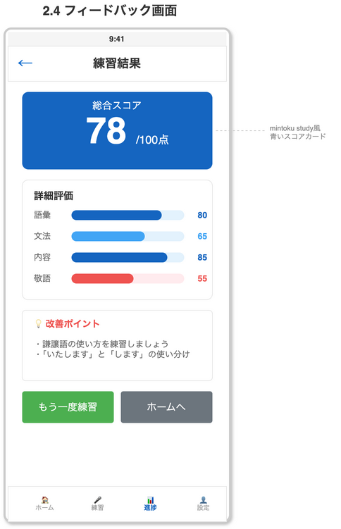

# 13. 面接シナリオ設計（採用適性評価）

## 13.0 本設計書の位置づけ

### 13.0.1 評価体系の全体像

本システムでは、面接評価を以下の2つの評価軸で実施する:

| 評価種別 | 設計書 | 評価対象 | スコア範囲 | 評価タイミング |
|---------|--------|---------|----------|--------------|
| **日本語能力評価** | 07_評価ロジック | 語彙・文法・内容・敬語 | 0-100点 | 各回答ごとにGPT-4oで自動評価 |
| **採用適性評価** | 本設計書（13） | 適応力・コミュニケーション力・主体性・定着意向・協調性 | 1-5点 | セッション終了後に総合評価 |

### 13.0.2 本設計書の役割

本設計書は「**採用適性評価**」を定義する。具体的には:
- 外国人採用で求められる人材像（5つの評価軸）
- 面接シナリオ・質問バンクの構造
- 採用適性評価の詳細ルーブリック

日本語能力評価（語彙・文法・内容・敬語の自動評価）については07_評価ロジックを参照。

---

## 13.1 概要

### 13.1.1 目的
本ドキュメントは、外国人採用面接のAI面接官（HeyGen）用シナリオ設計を定義する。外国人採用に関する各種サイト情報を総合的に分析し、求められる人材像を明確化した上で、面接シナリオ・質問バンクの構造を定義する。

### 13.1.2 対象ユーザー
- 特定技能外国人（介護、飲食、建設、製造、宿泊、農業、ビルクリーニング等）
- 技術・人文知識・国際業務ビザ保有者
- 日本語能力: JLPT N1〜N5

### 13.1.3 関連ファイル
| ファイル | 説明 |
|---------|------|
| `backend/app/data/seed/question_categories.json` | 質問カテゴリマスタ（6カテゴリ） |
| `backend/app/data/seed/industries.json` | 業界マスタ（7業界） |
| `backend/app/data/seed/industry_prefectures.json` | 業界別都道府県マスタ |
| `backend/app/data/seed/question_bank.json` | 質問バンク（50問） |
| `backend/app/data/seed/scenario_templates.json` | シナリオテンプレート |
| `backend/app/data/seed/evaluation_criteria.json` | 評価基準 |
| `poc/heygen/knowledge-base.txt` | HeyGen用ナレッジベース |
| `poc/src/utils/questionPlaceholder.ts` | プレースホルダー置換ユーティリティ |

---

## 13.2 外国人採用で求められる人材像

### 13.2.1 基本要件（法的・資格面）

| 要件 | 確認方法 | 重要度 |
|------|----------|--------|
| 在留資格の有効性 | 在留カード確認 | 必須 |
| 特定技能試験合格 | 合格証明書確認 | 必須（特定技能の場合） |
| 日本語能力（N4以上） | JLPT証明書確認 | 必須 |
| 職歴の空白なし（3ヶ月以内） | 履歴書・面接で確認 | 重要 |

### 13.2.2 コア能力（5つの評価軸）

| 能力カテゴリ | 具体的な要素 | 重み | 代表的な評価質問 |
|-------------|-------------|------|-----------------|
| **適応力** | 日本文化への理解、異文化対応、困難への対処 | 20% | 「日本で困った経験とその対処法は？」 |
| **コミュニケーション力** | 日本語力、報連相の理解、傾聴力 | 25% | 「分からないことがあった時どうしますか？」 |
| **主体性** | 自己学習意欲、問題解決姿勢、向上心 | 20% | 「日本語学習で努力していることは？」 |
| **定着意向** | 長期就労意思、キャリアビジョン、家族の同意 | 20% | 「5年後どうなっていたいですか？」 |
| **協調性** | チームワーク、職場適応、柔軟性 | 15% | 「チームで働く時に大切にすることは？」 |

### 13.2.3 業界別追加要件

| 業界 | 特有の要件 | 重点評価カテゴリ |
|------|----------|----------------|
| **介護** | 高齢者への配慮、身体介助経験、夜勤対応、感情コントロール | 適応力・協調性 |
| **飲食** | 接客経験、衛生意識、シフト柔軟性、スピード感 | コミュニケーション・協調性 |
| **建設** | 体力、安全意識、チームワーク、危険予知 | 主体性・協調性 |
| **製造** | 正確性、集中力、品質管理意識、単調作業耐性 | 主体性・定着意向 |
| **宿泊** | おもてなし精神、言語力、臨機応変さ | コミュニケーション・適応力 |
| **農業** | 体力、自然環境への適応、早起き、季節労働対応 | 適応力・定着意向 |
| **ビルクリーニング** | 丁寧さ、衛生意識、体力、時間管理 | 主体性・定着意向 |

---

## 13.3 面接シナリオ構造

### 13.3.1 シナリオフロー（時間軸ベース・45分想定）

```
【導入】5分
├── 挨拶・アイスブレイク
├── 面接の流れ説明
└── リラックス促進

【過去】10分（経験・背景の確認）
├── 来日理由・経緯
├── 職歴・学歴
├── 日本語学習の経緯
└── 困難を乗り越えた経験

【現在】10分（能力・適性の確認）
├── 現在の日本語学習状況
├── 強み・弱み
├── 仕事に対する価値観
└── 希望条件の確認

【未来】10分（意欲・ビジョンの確認）
├── 志望動機
├── キャリアプラン
├── 日本での生活設計
└── 会社への貢献イメージ

【条件確認】5分
├── 勤務条件の確認（残業・シフト）
├── 在留資格の確認
└── 家族の同意確認

【クロージング】5分
├── 逆質問
├── 今後の流れ説明
└── 挨拶
```

### 13.3.2 質問カテゴリ構成

| カテゴリID | カテゴリ名 | 時間軸 | 所要時間 | 質問数 |
|-----------|----------|--------|---------|--------|
| introduction | 導入・アイスブレイク | - | 5分 | 5問 |
| past_experience | 過去（経験・背景） | past | 10分 | 12問 |
| present_ability | 現在（能力・適性） | present | 10分 | 12問 |
| future_vision | 未来（意欲・ビジョン） | future | 10分 | 10問 |
| conditions | 条件確認 | - | 5分 | 6問 |
| closing | クロージング | - | 5分 | 5問 |

### 13.3.3 JLPTレベル別対応

| レベル | 質問の特徴 | 話速 | 簡易版使用 | フォローアップ深度 |
|-------|----------|------|-----------|------------------|
| N1-N2 | 標準的なビジネス日本語、敬語使用 | 通常 | No | 深い（3回まで） |
| N3 | やや簡潔な表現、平易な敬語 | ゆっくり | No | 標準（2回まで） |
| N4-N5 | 簡単な語彙、短文、やさしい日本語 | かなりゆっくり | Yes | 浅い（1回まで） |

---

## 13.4 質問バンク設計

### 13.4.1 質問構造

```json
{
  "id": "Q06",
  "category_id": "past_experience",
  "question_ja": "日本に来ようと思った理由を教えてください。",
  "question_simplified": "どうして日本に来ましたか？",
  "question_reading": "にほんにこようとおもったりゆうをおしえてください。",
  "difficulty": 2,
  "industries": ["all"],
  "evaluation_points": ["initiative", "retention"],
  "follow_ups": ["日本の何に魅力を感じましたか？"],
  "good_answer_indicators": ["具体的な理由がある", "長期的なビジョンがある"],
  "red_flags": ["お金のことだけ言及", "具体性がない"]
}
```

### 13.4.2 質問一覧（50問）

#### 導入・アイスブレイク（5問: Q01-Q05）
| ID | 質問（標準） | 評価ポイント |
|----|------------|-------------|
| Q01 | 本日はお越しいただきありがとうございます。緊張していませんか？ | - |
| Q02 | 今日はどのようにしてここまで来ましたか？ | コミュニケーション |
| Q03 | 日本の生活には慣れましたか？ | 適応力 |
| Q04 | 最近、休みの日は何をしていますか？ | - |
| Q05 | 日本で好きな食べ物は何ですか？ | - |

#### 過去（経験・背景）（12問: Q06-Q17）
| ID | 質問（標準） | 評価ポイント |
|----|------------|-------------|
| Q06 | 日本に来ようと思った理由を教えてください | 主体性・定着意向 |
| Q07 | 母国ではどのような仕事をしていましたか？ | 主体性 |
| Q08 | 日本語はどのように勉強しましたか？ | 主体性 |
| Q09 | 日本で困った経験はありますか？どう対処しましたか？ | 適応力・主体性 |
| Q10 | 前の職場で一番頑張ったことは何ですか？ | 主体性 |
| Q11 | アルバイトの経験について教えてください | 主体性 |
| Q12 | 日本の学校でどんなことを勉強しましたか？ | 主体性 |
| Q13 | 仕事でストレスを感じた経験はありますか？ | 適応力 |
| Q14 | チームで何かを達成した経験を教えてください | 協調性 |
| Q15 | 上司や先輩に叱られた経験はありますか？ | 適応力 |
| Q16 | 母国の良いところを教えてください | - |
| Q17 | 日本に来る前、日本についてどのように調べましたか？ | 主体性 |

#### 現在（能力・適性）（12問: Q18-Q29）
| ID | 質問（標準） | 評価ポイント |
|----|------------|-------------|
| Q18 | あなたの強みは何ですか？ | 主体性 |
| Q19 | 改善したい点や課題はありますか？ | 主体性 |
| Q20 | 日本語で難しいと感じることは何ですか？ | コミュニケーション・主体性 |
| Q21 | 仕事で大切にしていることは何ですか？ | 主体性 |
| Q22 | チームで働くとき、あなたはどんな役割ですか？ | 協調性 |
| Q23 | 分からないことがあったとき、どうしますか？ | コミュニケーション |
| Q24 | 日本語を勉強するために、今努力していることは？ | 主体性 |
| Q25 | 仕事とプライベートのバランスについてどう考えますか？ | - |
| Q26 | 急な仕事の変更があった場合、どう対応しますか？ | 適応力 |
| Q27 | 宗教上で配慮が必要なことはありますか？ | - |
| Q28 | 健康管理で気をつけていることはありますか？ | - |
| Q29 | 日本のどんなところが好きですか？ | 適応力・定着意向 |

#### 未来（意欲・ビジョン）（10問: Q30-Q39）
| ID | 質問（標準） | 評価ポイント |
|----|------------|-------------|
| Q30 | 当社を志望した理由を教えてください | 主体性・定着意向 |
| Q31 | 入社したらどんな仕事をしたいですか？ | 主体性 |
| Q32 | 5年後、どのようになっていたいですか？ | 定着意向・主体性 |
| Q33 | 日本でどのくらい働きたいと考えていますか？ | 定着意向 |
| Q34 | この仕事でどのように成長したいですか？ | 主体性 |
| Q35 | 会社を選ぶとき、一番大切な条件は何ですか？ | - |
| Q36 | 希望する給料を教えてください | - |
| Q37 | 将来、どのようなスキルを身につけたいですか？ | 主体性 |
| Q38 | 日本で取得したい資格はありますか？ | 主体性 |
| Q39 | 当社でどのように貢献できると思いますか？ | 主体性 |

#### 条件確認（6問: Q40-Q45）
| ID | 質問（標準） | 確認事項 |
|----|------------|---------|
| Q40 | 残業があっても大丈夫ですか？ | 勤務条件 |
| Q41 | 夜勤やシフト勤務は可能ですか？ | 勤務形態 |
| Q42 | 勤務地は〇〇ですが、通勤は大丈夫ですか？ | 勤務地 |
| Q43 | いつから働けますか？ | 入社時期 |
| Q44 | ご家族は日本で働くことに賛成していますか？ | 家族同意 |
| Q45 | 特定技能の試験には合格していますか？ | 資格確認 |

#### クロージング（5問: Q46-Q50）
| ID | 質問（標準） | 目的 |
|----|------------|-----|
| Q46 | 何かご質問はありますか？ | 逆質問 |
| Q47 | 当社について聞きたいことはありますか？ | 逆質問 |
| Q48 | 最後に伝えたいことはありますか？ | アピール機会 |
| Q49 | 本日の面接はいかがでしたか？ | フィードバック |
| Q50 | 本日はありがとうございました | クロージング |

### 13.4.3 動的プレースホルダー置換

質問テンプレート内の「〇〇」プレースホルダーは、面接開始時に業界に応じた都道府県名に動的に置換される。

#### 対象質問

| ID | テンプレート | 置換後の例 |
|----|-------------|-----------|
| Q42 | 勤務地は〇〇ですが、通勤は大丈夫ですか？ | 勤務地は愛知県ですが、通勤は大丈夫ですか？ |

#### 置換フロー

```
質問テンプレート「勤務地は〇〇ですが...」
           ↓
      業界ID取得（例: manufacturing）
           ↓
    ┌──────┴──────┐
    │             │
  ランダム     GPT選択
    │             │
    └──────┬──────┘
           ↓
   マスターデータから選択
   [愛知県, 静岡県, 大阪府]
           ↓
     「勤務地は愛知県ですが...」
```

#### ハイブリッド方式

| 方式 | 説明 | 用途 |
|------|------|------|
| ランダム選択 | マスターデータから均等確率で抽選 | 通常の面接練習 |
| GPT選択 | GPTがコンテキストを考慮して選択 | より現実的なシミュレーション |

いずれの方式でも、マスターデータに定義された都道府県からのみ選択される（ハルシネーション防止）。

#### 業界別都道府県マスター

| 業界ID | 業界名 | 都道府県（上位3） | 選定理由 |
|--------|--------|------------------|----------|
| nursing_care | 介護 | 東京都、神奈川県、愛知県 | 高齢化率が高く介護施設が多い都市部 |
| food_service | 飲食 | 東京都、大阪府、愛知県 | 飲食店が集中する大都市圏 |
| construction | 建設 | 東京都、愛知県、大阪府 | 再開発・インフラ整備が活発な地域 |
| manufacturing | 製造 | 愛知県、静岡県、大阪府 | 自動車・機械製造業の集積地 |
| hospitality | 宿泊 | 東京都、大阪府、京都府 | 観光需要が高い主要都市 |
| agriculture | 農業 | 茨城県、千葉県、長野県 | 大規模農業・園芸農業が盛んな地域 |
| building_cleaning | ビルクリーニング | 東京都、大阪府、神奈川県 | オフィスビル・商業施設が多い都市部 |

※ 厚生労働省「外国人雇用状況統計」を基に、各業界で外国人労働者の需要が高い上位3都道府県を選定

#### 関連ファイル

| ファイル | 説明 |
|----------|------|
| `backend/app/data/seed/industry_prefectures.json` | 業界別都道府県マスターデータ |
| `poc/src/utils/questionPlaceholder.ts` | プレースホルダー置換ユーティリティ |

---

## 13.5 評価基準（採用適性評価）

> **注意**: 本セクションは「**採用適性評価**」の評価基準を定義する。
> 日本語能力評価（語彙・文法・内容・敬語、0-100点スケール）については07_評価ロジックを参照。

### 13.5.1 5段階評価ルーブリック（採用適性評価）

| スコア | ラベル | 説明 |
|--------|-------|------|
| 5 | 優秀 | 期待を大きく上回る。即戦力として活躍できる。 |
| 4 | 良好 | 期待を上回る。適切なサポートで成長が見込める。 |
| 3 | 標準 | 期待通り。一般的な水準を満たしている。 |
| 2 | 要改善 | やや期待を下回る。追加確認や研修が必要。 |
| 1 | 不十分 | 期待を大きく下回る。採用は慎重に検討。 |

### 13.5.2 総合評価グレード

| グレード | スコア範囲 | ラベル | 推奨アクション |
|---------|----------|-------|--------------|
| A | 4.5-5.0 | 非常に優秀 | 即採用を強く推奨 |
| B | 4.0-4.49 | 優秀 | 採用を推奨 |
| C | 3.5-3.99 | 良好 | 採用を検討 |
| D | 3.0-3.49 | 標準 | 条件付きで採用を検討 |
| E | 2.0-2.99 | 要検討 | 再面接または不採用を検討 |
| F | 1.0-1.99 | 不適合 | 不採用を推奨 |

### 13.5.3 Red Flags（即不合格レベル）

- 在留資格に問題がある
- 特定技能試験に合格していない
- 職歴に3ヶ月以上の説明できない空白がある
- 面接中に虚偽の発言があった

### 13.5.4 Warning Signs（要注意レベル）

- 家族の同意が得られていない
- 短期間での退職歴が多い
- 給料だけが志望動機
- 質問への回答が極端に短い・長い
- 日本語能力が申告より明らかに低い

---

## 13.6 シナリオテンプレート

### 13.6.1 標準面接（45分）
全業界・全JLPTレベル対応の標準的な面接フロー。

### 13.6.2 短縮面接（30分）
時間が限られている場合の短縮版。

### 13.6.3 業界特化面接
- 介護業界特化面接
- 飲食業界特化面接
- 製造業界特化面接
- 建設業界特化面接
- 宿泊業界特化面接

詳細は `backend/app/data/seed/scenario_templates.json` を参照。

---

## 13.7 HeyGen統合

### 13.7.1 Knowledge Base
`poc/heygen/knowledge-base.txt` にHeyGen Interactive Avatar用のナレッジベースを定義。

### 13.7.2 動的KB生成（将来実装）
業界・JLPTレベルに応じて動的にKnowledge Baseを生成するロジックを実装予定。

```typescript
interface KnowledgeBaseGeneratorInput {
  industry: Industry;
  jlptLevel: JLPTLevel;
  companyInfo?: CompanyInfo;
  customQuestions?: Question[];
}

async function generateKnowledgeBase(input: KnowledgeBaseGeneratorInput): Promise<string> {
  // シナリオテンプレートから適切なものを選択
  // 質問バンクから業界・レベルに適した質問を抽出
  // HeyGen用フォーマットでKBを生成
}
```

---

## 13.8 データベーステーブル

新規追加テーブル:
- `question_categories` - 質問カテゴリマスタ
- `industries` - 業界マスタ
- `question_bank` - 質問バンク
- `scenario_templates` - シナリオテンプレート
- `scenario_template_questions` - テンプレート-質問関連

詳細は11_データベーススキーマを参照。

---

## 13.9 参考資料

### 13.9.1 情報収集元
- jinzaiplus.jp - 外国人採用面接の質問例
- gaikokujin-senmonka.com - 外国人採用の注意点
- 特定技能外国人採用ガイドライン

---

## 13.10 日本語能力評価との統合

### 13.10.1 両評価の役割分担

| 評価種別 | 評価対象 | 評価方法 | 用途 |
|---------|---------|---------|-----|
| **日本語能力評価** | 言語運用能力 | GPT-4oで各回答を自動評価 | 日本語学習の弱点把握 |
| **採用適性評価** | 人材としての適性 | セッション全体から総合評価 | 採用判断の参考 |

### 13.10.2 統合スコアの計算

両評価を統合した総合スコア（100点満点）を算出する:

```
総合スコア = (日本語能力スコア × 0.4) + (採用適性スコア × 20 × 0.6)

例:
- 日本語能力スコア: 75点
- 採用適性スコア: 4.0点（5点満点）
- 総合スコア = (75 × 0.4) + (4.0 × 20 × 0.6) = 30 + 48 = 78点
```

### 13.10.3 評価結果の表示

フィードバック画面では両評価を分けて表示する:



### 13.10.4 DBテーブル対応

| 評価種別 | 保存先テーブル |
|---------|--------------|
| 日本語能力評価 | evaluation_details（category: vocabulary, grammar, content, honorifics） |
| 採用適性評価 | aptitude_evaluations（category: adaptability, communication, initiative, retention, cooperation） |

詳細は11_データベーススキーマを参照。

---

### 13.9.2 更新履歴

| 日付 | バージョン | 変更内容 |
|------|----------|---------|
| 2026-02-01 | 1.0.0 | 初版作成 |
| 2026-02-01 | 1.1.0 | 評価体系の位置づけを追記、日本語能力評価（07）との統合方法を追加 |
| 2026-02-01 | 1.2.0 | 動的プレースホルダー置換（業界別都道府県選択）を追加 |
