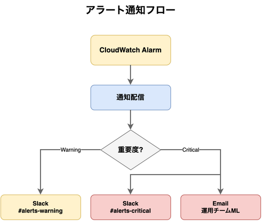
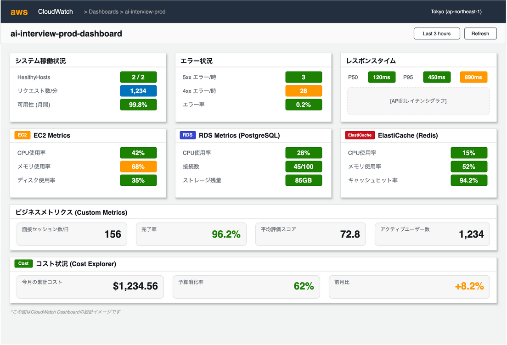
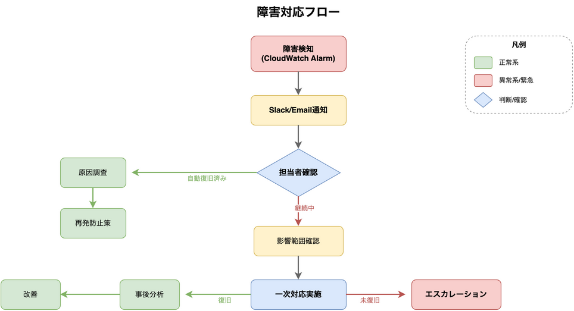

# 15. 監視設計

## 15.1 監視方針

### 目的

| 目的 | 内容 |
|------|------|
| 可用性確保 | システム障害の早期検知と迅速な対応 |
| パフォーマンス維持 | レスポンス劣化の検知と原因特定 |
| セキュリティ監視 | 不正アクセス・異常動作の検知 |
| コスト管理 | 予算超過の防止 |

### SLI/SLO定義

| 指標 (SLI) | 目標 (SLO) | 測定方法 |
|-----------|-----------|---------|
| 可用性 | 99.5% / 月 | ALB HealthyHostCount |
| レスポンスタイム (P95) | < 2秒 | ALB TargetResponseTime |
| エラー率 | < 1% | ALB 5xx / 総リクエスト |
| 面接セッション完了率 | > 95% | アプリログ集計 |

## 15.2 メトリクス監視

### EC2アラーム

| メトリクス | 閾値 | 期間 | 重要度 | アクション |
|-----------|-----|------|--------|-----------|
| CPUUtilization | > 80% | 5分 | Warning | Slack通知 |
| CPUUtilization | > 95% | 5分 | Critical | Slack + Email |
| StatusCheckFailed | > 0 | 1分 | Critical | Slack + Email |
| MemoryUtilization | > 85% | 5分 | Warning | Slack通知 |
| DiskSpaceUtilization | > 80% | 5分 | Warning | Slack通知 |

### ALBアラーム

| メトリクス | 閾値 | 期間 | 重要度 | アクション |
|-----------|-----|------|--------|-----------|
| TargetResponseTime | > 2秒 | 5分 | Warning | Slack通知 |
| TargetResponseTime | > 5秒 | 5分 | Critical | Slack + Email |
| HTTPCode_Target_5XX_Count | > 10 | 1分 | Critical | Slack + Email |
| HTTPCode_ELB_5XX_Count | > 5 | 1分 | Critical | Slack + Email |
| HealthyHostCount | < 1 | 1分 | Critical | Slack + Email |
| RequestCount | < 1 | 15分 | Warning | Slack通知 |

### RDSアラーム

| メトリクス | 閾値 | 期間 | 重要度 | アクション |
|-----------|-----|------|--------|-----------|
| CPUUtilization | > 80% | 5分 | Warning | Slack通知 |
| CPUUtilization | > 95% | 5分 | Critical | Slack + Email |
| FreeStorageSpace | < 10GB | 5分 | Warning | Slack通知 |
| FreeStorageSpace | < 5GB | 5分 | Critical | Slack + Email |
| DatabaseConnections | > 80% of max | 5分 | Warning | Slack通知 |
| ReadLatency | > 20ms | 5分 | Warning | Slack通知 |
| WriteLatency | > 20ms | 5分 | Warning | Slack通知 |

### ElastiCacheアラーム

| メトリクス | 閾値 | 期間 | 重要度 | アクション |
|-----------|-----|------|--------|-----------|
| CPUUtilization | > 80% | 5分 | Warning | Slack通知 |
| EngineCPUUtilization | > 90% | 5分 | Critical | Slack + Email |
| DatabaseMemoryUsagePercentage | > 80% | 5分 | Warning | Slack通知 |
| CurrConnections | > 1000 | 5分 | Warning | Slack通知 |
| Evictions | > 100 | 5分 | Warning | Slack通知 |

### CloudFrontアラーム

| メトリクス | 閾値 | 期間 | 重要度 | アクション |
|-----------|-----|------|--------|-----------|
| 5xxErrorRate | > 5% | 5分 | Critical | Slack + Email |
| 4xxErrorRate | > 10% | 5分 | Warning | Slack通知 |
| OriginLatency | > 3秒 | 5分 | Warning | Slack通知 |

## 15.3 ログ監視

### ログ種別と保持期間

| ログ種別 | 送信先 | 保持期間 | 用途 |
|---------|-------|---------|------|
| アプリケーションログ | CloudWatch Logs | 90日 | デバッグ・障害調査 |
| ALBアクセスログ | S3 | 365日 | アクセス分析・セキュリティ |
| CloudTrail | S3 | 365日 | API監査・コンプライアンス |
| VPC Flow Logs | CloudWatch Logs | 30日 | ネットワーク調査 |
| RDS監査ログ | CloudWatch Logs | 90日 | DB操作追跡 |
| RDSスロークエリログ | CloudWatch Logs | 30日 | パフォーマンス分析 |

### ログアラート（CloudWatch Logs Insights）

| パターン | 条件 | 重要度 |
|---------|------|--------|
| エラーログ急増 | ERROR > 50件/5分 | Critical |
| 認証失敗 | AUTH_FAILED > 10件/分 | Warning |
| HeyGen接続エラー | HEYGEN_ERROR > 5件/5分 | Critical |
| STT接続エラー | STT_ERROR > 5件/5分 | Critical |
| DB接続エラー | DB_CONNECTION_ERROR > 3件/分 | Critical |

### ログフォーマット（構造化ログ）

```json
{
  "timestamp": "2025-02-01T10:30:00.000Z",
  "level": "ERROR",
  "service": "ai-interview-api",
  "trace_id": "abc123",
  "user_id": "usr_456",
  "session_id": "ses_789",
  "message": "HeyGen session creation failed",
  "error": {
    "type": "HeyGenAPIError",
    "code": "SESSION_LIMIT_EXCEEDED",
    "detail": "Maximum concurrent sessions reached"
  },
  "duration_ms": 1523
}
```

## 15.4 アラート設計

### 通知フロー



### SNSトピック構成

| トピック名 | 用途 | 通知先 |
|-----------|------|-------|
| ai-interview-alerts-warning | Warning通知 | Slack (#alerts-warning) |
| ai-interview-alerts-critical | Critical通知 | Slack (#alerts-critical) + Email |

### Slack通知フォーマット

```
🟡 [WARNING] EC2 CPU使用率上昇
━━━━━━━━━━━━━━━━━━━━━━━━━━
リソース: ai-interview-api-prod
メトリクス: CPUUtilization
現在値: 82.5%
閾値: 80%
時刻: 2025-02-01 10:30:00 JST
━━━━━━━━━━━━━━━━━━━━━━━━━━
🔗 CloudWatch | 📊 Dashboard
```

```
🔴 [CRITICAL] ALB 5xxエラー多発
━━━━━━━━━━━━━━━━━━━━━━━━━━
リソース: ai-interview-alb-prod
メトリクス: HTTPCode_Target_5XX_Count
現在値: 45件/分
閾値: 10件/分
時刻: 2025-02-01 10:30:00 JST
━━━━━━━━━━━━━━━━━━━━━━━━━━
🔗 CloudWatch | 📊 Dashboard | 📋 Logs
```

## 15.5 ダッシュボード

### メインダッシュボード構成



### ダッシュボードウィジェット詳細

| ウィジェット | 種類 | データソース |
|-------------|------|-------------|
| システム稼働状況 | 数値 | ALB HealthyHostCount |
| リクエスト数推移 | 折れ線グラフ | ALB RequestCount |
| エラー率推移 | 折れ線グラフ | ALB 5xx/4xx Count |
| レスポンスタイム | 折れ線グラフ | ALB TargetResponseTime (P50/P95/P99) |
| EC2メトリクス | 折れ線グラフ | CloudWatch Agent |
| RDSメトリクス | 折れ線グラフ | RDS Enhanced Monitoring |
| セッション数 | 棒グラフ | カスタムメトリクス |
| コスト | 数値 + グラフ | Cost Explorer API |

## 15.6 コスト監視

### 予算アラート

| 閾値 | 通知先 | アクション |
|-----|-------|-----------|
| 50%消化 | Slack | 情報通知 |
| 80%消化 | Slack + Email | 警告通知 |
| 100%消化 | Slack + Email | 緊急対応検討 |
| 120%超過 | Slack + Email | リソース見直し |

### コスト配分タグ

| タグキー | 値例 | 用途 |
|---------|-----|------|
| Project | ai-interview | プロジェクト別集計 |
| Environment | dev / prod | 環境別集計 |
| Service | api / frontend / db | サービス別集計 |

## 15.7 障害対応フロー



### 障害レベル定義

| レベル | 定義 | 対応時間目標 | 対応者 |
|-------|------|-------------|-------|
| Critical | サービス停止・主要機能不可 | 15分以内 | 運用チーム全員 |
| Warning | 性能劣化・一部機能影響 | 1時間以内 | 担当者 |
| Info | 軽微な異常・予防的通知 | 翌営業日 | 担当者 |
