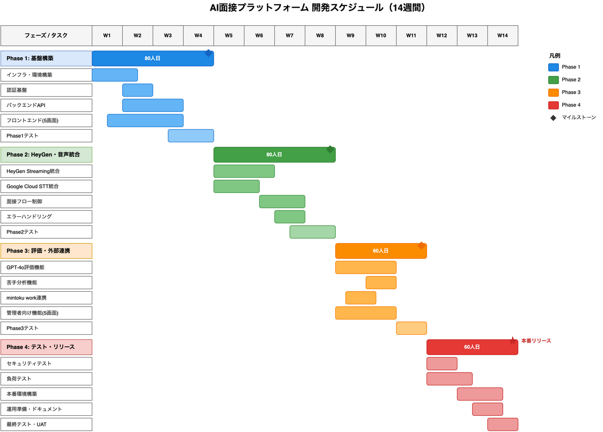

# 3. 開発工数見積

## 3.1 見積サマリー

| 項目 | 数値 |
|------|------|
| **総開発期間** | 16週間（約4ヶ月） |
| **総工数** | 約13人月（260人日） |

### 開発スケジュール（ガントチャート）

### フェーズ別期間サマリー

| フェーズ | 期間 | 開始 | 終了 | 主要成果物 |
|---------|------|------|------|-----------|
| **Phase 1** | 4週間 | Week 1 | Week 4 | 基盤構築完了、ユーザー向け7画面、基本API |
| **Phase 2** | 5週間 | Week 5 | Week 9 | HeyGenアバター統合、音声認識、面接フロー、学習計画機能 |
| **Phase 3** | 4週間 | Week 10 | Week 13 | AI評価機能（二重評価）、管理者画面8画面、mintoku連携 |
| **Phase 4** | 3週間 | Week 14 | Week 16 | セキュリティ・負荷テスト、本番リリース |

---

## 3.2 開発規模

### 3.2.1 画面数

| カテゴリ | 画面数 | 備考 |
|---------|--------|------|
| 一般ユーザー向け（モバイル） | 7画面 | SSOログイン、ホーム、練習モード選択、面接練習（チャレンジ選択含む）、フィードバック、学習進捗、設定 |
| 管理者向け | 8画面 | ログイン、ダッシュボード、面接結果一覧、結果詳細、質問管理、質問編集、ユーザー一覧、ユーザー詳細分析 |
| **合計** | **15画面** | |

### 3.2.2 APIエンドポイント数

| カテゴリ | エンドポイント数 | 備考 |
|---------|-----------------|------|
| 認証API | 3 | SSO callback、refresh、logout |
| 面接セッションAPI | 5 | create、get、answers、complete、history |
| 評価API | 3 | status、get、summary |
| 質問API | 4 | questions、scripts一覧、scripts詳細、learning-plan |
| 管理者向けAPI | 9 | login、questions CRUD、users、sessions、statistics |
| 外部連携API | 2 | mintoku結果送信、Webhook受信 |
| **合計** | **26エンドポイント** | |

### 3.2.3 データベーステーブル数

| カテゴリ | テーブル数 | テーブル名 |
|---------|-----------|----------|
| ユーザー・学習管理 | 4 | users, user_preferred_industries, learning_plans, learning_steps |
| セッション管理 | 2 | interview_sessions, session_answers |
| 評価関連 | 4 | evaluations, evaluation_details, aptitude_evaluations, weak_points |
| マスタデータ | 4 | question_categories, industries, question_bank, scenario_templates |
| 同期管理 | 1 | mintoku_sync_queue |
| **合計** | **15テーブル** | |

### 3.2.4 外部サービス連携

| サービス | 連携内容 | 複雑度 |
|---------|---------|--------|
| HeyGen Streaming Avatar | アバター表示、リップシンク発話、JLPTレベル別話速 | 高 |
| Google Cloud STT | 音声認識（リアルタイム文字起こし）、WebSocketストリーミング | 高 |
| OpenAI GPT-4o | 日本語能力評価（4カテゴリ）、採用適性評価（5軸）、苦手分析 | 高 |
| mintoku work | SSO認証、評価結果送信、Webhook受信（業界変更通知） | 中 |

---

## 3.3 フェーズ別工数詳細

### Phase 1: 基盤構築（4週間 / 80人日）

| タスク | 工数（人日） | 担当ロール |
|--------|------------|-----------|
| **インフラ・環境構築** | | |
| 開発環境Docker化 | 2 | インフラ |
| AWSリソース構築（EC2, RDS, S3, ElastiCache） | 5 | インフラ |
| CI/CDパイプライン構築（GitHub Actions） | 3 | インフラ |
| PostgreSQLスキーマ作成（15テーブル） | 4 | バックエンド |
| **小計** | **14** | |
| **認証基盤** | | |
| mintoku work SSO連携（OAuth 2.0 / OIDC） | 5 | バックエンド |
| JWT認証実装（アクセス・リフレッシュトークン） | 3 | バックエンド |
| セキュリティ設定（HTTPS、CORS、CSP） | 2 | バックエンド |
| **小計** | **10** | |
| **バックエンドAPI** | | |
| FastAPIプロジェクト初期設定 | 2 | バックエンド |
| 認証API（3エンドポイント） | 4 | バックエンド |
| セッションAPI（5エンドポイント） | 6 | バックエンド |
| 質問API（4エンドポイント） | 4 | バックエンド |
| **小計** | **16** | |
| **フロントエンド（ユーザー向け7画面）** | | |
| Next.js プロジェクト初期設定 | 2 | フロントエンド |
| SSOログイン画面（フォールバック用） | 2 | フロントエンド |
| ホーム画面（学習計画進捗カード含む） | 5 | フロントエンド |
| 練習モード選択画面 | 3 | フロントエンド |
| 面接練習画面（テキストベース版） | 5 | フロントエンド |
| フィードバック画面（評価処理中UI含む） | 5 | フロントエンド |
| 学習進捗画面（グラフ・苦手項目） | 5 | フロントエンド |
| 設定画面（多言語対応13言語） | 3 | フロントエンド |
| 共通コンポーネント（ナビ、レスポンシブ） | 4 | フロントエンド |
| **小計** | **34** | |
| **テスト（Phase 1）** | | |
| ユニットテスト（バックエンド） | 3 | QA |
| ユニットテスト（フロントエンド） | 3 | QA |
| **小計** | **6** | |
| **Phase 1 合計** | **80人日** | |

---

### Phase 2: HeyGenアバター・音声認識・学習計画統合（5週間 / 100人日）

| タスク | 工数（人日） | 担当ロール |
|--------|------------|-----------|
| **HeyGen Streaming Avatar統合** | | |
| HeyGen SDK導入・初期設定 | 3 | フロントエンド |
| WebRTCセッション管理 | 5 | フロントエンド |
| アバター発話制御（TaskType.REPEAT） | 4 | フロントエンド |
| JLPTレベル別話速設定（N1:1.0〜N5:0.5） | 2 | フロントエンド |
| 発話完了イベントハンドリング | 3 | フロントエンド |
| フォールバック処理（テキストモード切替） | 3 | フロントエンド |
| **小計** | **20** | |
| **Google Cloud STT統合** | | |
| Google Cloud STT設定・認証 | 2 | バックエンド |
| WebSocket音声ストリーミング | 5 | バックエンド |
| リアルタイム文字起こし表示 | 4 | フロントエンド |
| 無音検出・自動停止（5秒） | 2 | バックエンド |
| テキスト入力フォールバック | 2 | フロントエンド |
| **小計** | **15** | |
| **面接フロー制御** | | |
| 質問→回答ループ実装 | 5 | フロントエンド |
| スキップ機能 | 2 | フロントエンド |
| セッション状態管理（6状態遷移） | 4 | フロントエンド |
| 接続ステータス表示 | 2 | フロントエンド |
| **小計** | **13** | |
| **学習計画機能** | | |
| 学習計画自動生成ロジック | 5 | バックエンド |
| 学習ステップ進捗管理 | 4 | バックエンド |
| 練習モード切替（学習計画/自由練習） | 3 | フロントエンド |
| チャレンジ機能（上位レベル挑戦） | 4 | フロントエンド |
| ウォームアップモード（長期離脱者向け） | 3 | バックエンド |
| 業界変更時の学習計画更新 | 3 | バックエンド |
| **小計** | **22** | |
| **エラーハンドリング** | | |
| アバター接続失敗時リトライ・フォールバック | 4 | フロントエンド |
| マイク許可なし時の誘導ダイアログ | 2 | フロントエンド |
| 音声認識失敗時のテキスト入力切替 | 2 | フロントエンド |
| ネットワーク切断時の再接続試行 | 4 | フロントエンド |
| セッションタイムアウト処理（60分） | 2 | バックエンド |
| **小計** | **14** | |
| **テスト（Phase 2）** | | |
| ユニットテスト（新機能） | 5 | QA |
| 統合テスト（HeyGen + STT + 面接フロー） | 8 | QA |
| ブラウザ互換性テスト | 3 | QA |
| **小計** | **16** | |
| **Phase 2 合計** | **100人日** | |

---

### Phase 3: 評価機能・管理者画面・外部連携（4週間 / 80人日）

| タスク | 工数（人日） | 担当ロール |
|--------|------------|-----------|
| **GPT-4o評価機能（二重評価体系）** | | |
| 評価API実装 | 3 | バックエンド |
| 日本語能力評価（語彙・文法・内容・敬語、JLPTレベル別重み付け） | 6 | バックエンド |
| 採用適性評価（適応力・コミュニケーション力・主体性・定着意向・協調性） | 5 | バックエンド |
| 統合スコア計算（日本語40%＋適性60%） | 2 | バックエンド |
| JLPTレベル乖離検出・警告生成 | 3 | バックエンド |
| 苦手項目検出・蓄積ロジック（閾値70点） | 3 | バックエンド |
| 企業向け統合評価レポート生成 | 3 | バックエンド |
| 評価結果DB保存（非同期処理） | 2 | バックエンド |
| **小計** | **27** | |
| **適応型レベル調整機能** | | |
| レベル調整ロジック（スコア別自動調整） | 3 | バックエンド |
| フィードバック画面のレベル調整ボタン表示 | 2 | フロントエンド |
| 平均スコア計算・表示 | 2 | フロントエンド |
| LocalStorageデータ復旧処理 | 2 | フロントエンド |
| **小計** | **9** | |
| **mintoku work連携** | | |
| 評価結果送信API実装 | 3 | バックエンド |
| リトライ処理（指数バックオフ、同期キュー） | 3 | バックエンド |
| Webhook受信（ユーザー情報更新） | 3 | バックエンド |
| 非ログイン時のWebhook処理（pending_industry） | 2 | バックエンド |
| **小計** | **11** | |
| **管理者向け機能（8画面）** | | |
| 管理者ログイン画面・認証 | 3 | フロントエンド |
| ダッシュボード画面（KPI・統計） | 4 | フロントエンド |
| 面接結果一覧画面（検索・フィルタ・エクスポート） | 4 | フロントエンド |
| 結果詳細画面（タブ切替：概要・履歴・質問回答・企業レポート） | 5 | フロントエンド |
| 質問管理画面（一覧・作成・編集・削除） | 4 | フロントエンド |
| ユーザー一覧画面（AI面談実施ユーザー） | 3 | フロントエンド |
| ユーザー詳細分析画面（成長曲線・苦手・履歴タブ） | 4 | フロントエンド |
| 管理者向けAPI（9エンドポイント） | 6 | バックエンド |
| **小計** | **33** | |
| **Phase 3 合計** | **80人日** | |

---

### Phase 4: テスト・本番リリース準備（3週間 / 60人日）

| タスク | 工数（人日） | 担当ロール |
|--------|------------|-----------|
| **セキュリティテスト** | | |
| OWASP Top 10脆弱性チェック | 5 | セキュリティ |
| 認証・認可テスト（SSO、JWT、管理者認証） | 3 | QA |
| 入力バリデーションテスト | 2 | QA |
| Webhook署名検証テスト | 1 | QA |
| セキュリティ監査レポート作成 | 2 | セキュリティ |
| **小計** | **13** | |
| **負荷テスト** | | |
| 同時100ユーザー目標テスト | 4 | QA |
| HeyGen/STT同時接続テスト | 3 | QA |
| API応答時間測定 | 2 | QA |
| ボトルネック特定・改善 | 4 | バックエンド |
| **小計** | **13** | |
| **本番環境構築** | | |
| 本番AWSリソース構築 | 5 | インフラ |
| SSL証明書設定 | 1 | インフラ |
| CloudWatch監視設定 | 3 | インフラ |
| バックアップ設定（S3ライフサイクル90日） | 2 | インフラ |
| アラート設定 | 2 | インフラ |
| **小計** | **13** | |
| **運用準備** | | |
| 運用マニュアル作成 | 3 | PM |
| 障害対応手順書 | 2 | インフラ |
| ドキュメント整備 | 3 | PM |
| リリースチェックリスト | 1 | PM |
| **小計** | **9** | |
| **最終テスト** | | |
| 本番環境での動作確認 | 5 | QA |
| E2Eテスト（全フロー通し） | 5 | QA |
| 最終バグ修正 | 2 | 開発全般 |
| **小計** | **12** | |
| **Phase 4 合計** | **60人日** | |

---

## 3.4 役割別工数サマリー

| ロール | Phase 1 | Phase 2 | Phase 3 | Phase 4 | 合計 |
|--------|---------|---------|---------|---------|------|
| PM/PL | 5 | 5 | 5 | 9 | 24 |
| インフラエンジニア | 14 | 2 | 2 | 13 | 31 |
| バックエンドエンジニア | 20 | 24 | 36 | 4 | 84 |
| フロントエンドエンジニア | 34 | 53 | 28 | 0 | 115 |
| QA/テストエンジニア | 6 | 16 | 0 | 32 | 54 |
| セキュリティエンジニア | 0 | 0 | 0 | 7 | 7 |
| **合計** | **80** | **100** | **80** | **60** | **320** |

> **注**: 計算上の合計は320人日だが、並行作業とバッファ調整により実効工数は約260人日（13人月）

---

## 3.5 推奨体制

### 3.5.1 基本チーム構成（4〜5名体制）

| ロール | 人数 | 担当範囲 |
|--------|------|---------|
| PM/PL | 1名 | プロジェクト管理、顧客折衝、ドキュメント |
| バックエンドエンジニア | 1〜2名 | API開発、DB設計、GPT-4o統合、外部連携、インフラ兼務 |
| フロントエンドエンジニア | 1〜2名 | UI実装、HeyGen統合、STT統合、状態管理 |
| QAエンジニア | 1名 | テスト設計・実行、セキュリティテスト |

### 3.5.2 スキル要件

| ロール | 必須スキル |
|--------|-----------|
| バックエンド | Python/FastAPI、PostgreSQL、AWS、OAuth 2.0/OIDC、OpenAI API |
| フロントエンド | React/Next.js/TypeScript、WebRTC、WebSocket、状態管理（Zustand等） |
| QA | 自動テスト、負荷テスト、セキュリティテスト基礎 |

---

## 3.6 前バージョンからの主な変更点

| 項目 | 旧見積（v1.1） | 新見積（v2.0） | 変更理由 |
|------|--------------|--------------|---------|
| 総工数 | 11.5人月 | 13人月 | 機能追加による増加 |
| 期間 | 14週間 | 16週間 | Phase 2を5週間に拡張 |
| 画面数 | 10画面 | 15画面 | 練習モード選択、詳細画面追加 |
| API数 | 19 | 26 | 学習計画API、詳細管理API追加 |
| テーブル数 | 21 | 15 | 設計最適化で統合 |

### 追加された主要機能

1. **学習計画機能**: 業界別学習計画の自動生成、ステップ進捗管理
2. **二重評価体系**: 日本語能力評価＋採用適性評価の統合
3. **適応型レベル調整**: スコアに基づくJLPTレベル自動調整
4. **企業向け統合レポート**: 推定実力レベル、業務適性判定
5. **チャレンジ機能**: 上位レベルへの挑戦モード
6. **ウォームアップモード**: 長期離脱ユーザー向け
7. **mintoku Webhook連携**: 業界変更通知の受信・処理

---

## 3.7 工数算出の前提条件

1. **1人月 = 20人日** で計算
2. **1日 = 8時間** の稼働を前提
3. 祝日・有給等は含まない純粋な稼働日数
4. 要件変更が発生した場合は別途見積
5. 外部API（HeyGen、Google Cloud、OpenAI、mintoku work）の仕様変更リスクは考慮済み
6. テスト工数には不具合修正の工数を含む
7. 多言語対応（13言語）のUIテキスト翻訳は外部委託を想定

---

## 3.8 リスクと対策

| リスク | 影響度 | 発生確率 | 対策 |
|--------|--------|---------|------|
| HeyGen API仕様変更 | 高 | 中 | フォールバックモード（テキスト表示）の実装、SDK更新監視 |
| GPT-4o応答遅延 | 中 | 中 | 非同期評価処理、タイムアウト設定、評価待ちUI |
| mintoku work連携仕様未確定 | 高 | 低 | モック実装で開発進行、インターフェース早期確定 |
| 多言語翻訳品質 | 中 | 中 | ネイティブチェック、段階的リリース |
| 負荷テスト結果による改修 | 中 | 中 | Phase 4にバッファ確保、アーキテクチャレビュー |

---

## 改訂履歴

| 日付 | バージョン | 内容 |
|------|-----------|------|
| 2026-02-03 | 1.0 | 初版作成 |
| 2026-02-04 | 1.1 | ガントチャート追加 |
| 2026-02-05 | 2.0 | 最新設計書（v2.6）に基づき全面改訂: 画面数15画面、API数26、学習計画機能、二重評価体系、適応型レベル調整、企業向けレポート等の追加機能を反映。総工数13人月、期間16週間に更新 |
